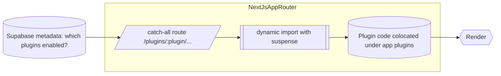
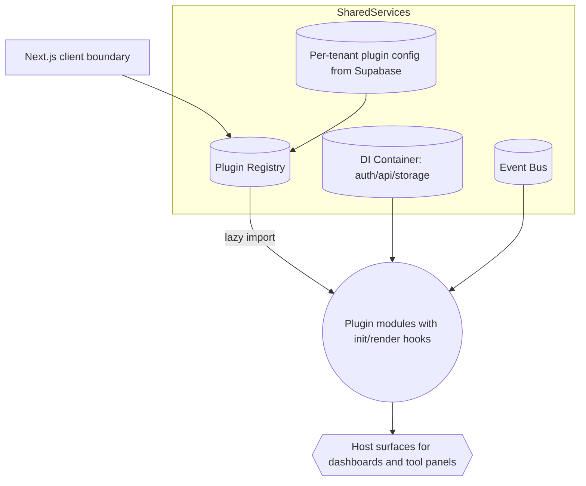
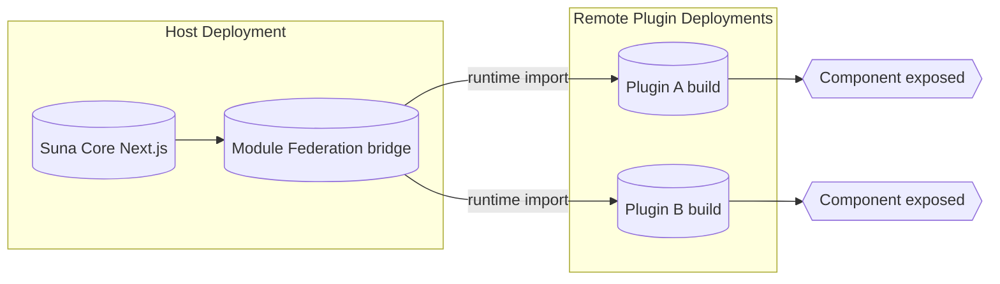

# Plugin Architecture Options for the Suna App

## Context Snapshot
- **Frontend**: Next.js 15 App Router with React Server Components, multi-domain support (Cloudflare tunnel + localhost).
- **Backend**: AgentPress auto-discovers tools with graceful degradation (e.g., optional Daytona sandbox).
- **Config & Tenancy**: Supabase handles auth/storage; plugin toggles can be stored per tenant.
- **Goal**: Align frontend plugin strategy with backend extensibility and multi-tenant requirements.

## Pattern Overview
| Pattern | Deployment Coupling | Config Source | Ideal Use | Trade-offs |
| --- | --- | --- | --- | --- |
| **Route-Based Dynamic Imports** | Single repo build | Supabase to decide which routes/plugins render | Quick path to pluginized UI screens | Needs redeploy for new plugins; limited lifecycle hooks |
| **Runtime Plugin Registry (In-App)** | Single repo build | Supabase + registry metadata | Deep integration & per-tenant enablement | Requires contracts, validation, DI, and event bus |
| **Module Federation** | Independent deployments | Remote manifests (`remoteEntry.js`) | Third-party marketplace / premium plugins | Highest operational complexity; MF support in Next.js 15 still maturing |

## Architecture Diagrams

### 1. Route-Based Dynamic Imports (Fastest to Ship)

### 2. Runtime Plugin Registry (Most Versatile)

### 3. Module Federation (Long-Term Marketplace)

## Recommendations
1. **Easiest / Near-Term** – Ship the route-based pattern now to validate plugin UX. Store plugin metadata in Supabase and wrap each plugin in its own `error.js` for graceful failure.
2. **Most Versatile** – Build out the runtime registry next so frontend plugins mirror AgentPress tool discovery (registry + DI + event bus + per-tenant toggles).
3. **Best Long-Term** – Layer Module Federation on top once internal tooling stabilizes, enabling third-party or premium plugins to deploy independently.

## Suggested Next Steps
1. Define a shared plugin contract (metadata schema + lifecycle hooks) aligned with backend tool metadata.
2. Prototype `/plugins/[plugin]/page.tsx` using the dynamic import pattern; persist plugin enablement in Supabase and expose via API route.
3. Draft a registry service (React context + validation) and map required shared services (auth, agent APIs, storage, event bus).
4. Start an RFC for Module Federation rollout (CI/CD, version negotiation, SSR compatibility) once internal plugins reach maturity.
