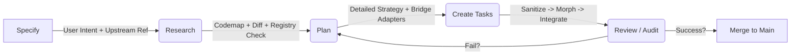

# Upstream Sync Strategy v5.0: The Living Strategy (Portkit)

**Location**: `.portkit/UPSTREAM_SYNC_STRATEGY.md`
**Status**: LIVING ARCHITECTURE DOCUMENT (Blueprint for Portkit)

## 0. What is Portkit?
**"Portkit"** is a specialized, spec-driven development framework for **syncing and porting features** from an upstream production repository to a customized fork.
*   **Concept**: Think of it as "Speckit for Upstream Sync".
*   **Goal**: Replace manual "git merge" with a structured, agent-guided pipeline (Research -> Plan -> Morph -> Audit).
*   **Structure**: This document is the **Master Plan**. It is NOT an executable workflow. Executable agent prompts live in their IDE specific folders.

## 1. The Core Philosophy
A "Soft Fork" cannot survive by manually merging files one by one. It requires a **Platform Approach**:
*   **Upstream**: Treated as an external dependency we ingest.
*   **Custom Features**: Treated as "Add-ons" that hook into the upstream code.
*   **Sync Process**: An automated compilation pipeline, not a manual text merge.

## 1.5. Ingestion Strategy (The "Source of Truth")
To analyze upstream code without polluting our repo, we use a **Shadow Cache Strategy**:
*   **Location**: `.upstream-cache/` (Gitignored).
*   **Mechanism**: A script `scripts/fetch-upstream.ts` that:
    1.  Checks if `.upstream-cache` exists.
    2.  If not, clones the remote upstream repo (defined in `.portkit/config.json`).
    3.  If yes, performs `git fetch --all` and `git checkout <target_ref>`.
*   **Agent Access**: Agents are strictly forbidden from editing `.upstream-cache`. They treats it as Read-Only Reference Material.

## 1.6. Directory Structure (The "Physical" Architecture)
Use this reference to understand where components live:
```
.portkit/
├── UPSTREAM_SYNC_STRATEGY.md       # (This File) The Master Blueprint.
├── addon-features-registry/
│   └── addon-features-registry.json # The "Source of Truth" for custom features.
├── scripts/
│   ├── powershell/                 # Legacy/Windows-specific automation.
│   ├── typescript/                 # Node.js AST parsers & tools.
│   └── python/                     # Python AST parsers & tools.
├── templates/                      # Markdown templates for reports (e.g. codemap_report.md).
```
**External Dependencies**:
*   `.agent/workflows/` (General Agent Prompts).
*   `.claude/commands/` (Claude Desktop/CLI specific commands).
*   `.gemini/commands/` (Gemini specific commands - TOML format).
*   `.cursor/rules/` (Cursor IDE specific rules).

## 2. Architecture: Portkit Flow


### Executing Port Kit via Multi-Agents Workflow (optional)
You can either utilize a hierarchical agent structure or a sequential workflow. This minimizes context drift and ensures that each agent has a clear understanding of its role and responsibilities. You can create these agents for example in Claude Code. Here are some conceptual examples:

### 👑 The Orchestrator (Manager Agent) - will not be a subagent but rather main agent or agent instance where the initial workflow entry point is run
*   **Role**: Project Lead & Human Interface.
*   **Responsibilities**:
    *   Receives high-level intent ("Port the new Settings Page").
    *   Deploys sub-agents.
    *   Synthesizes all reports into a unified **Implementation Plan**.
    *   **Gatekeeper**: Demands the "Go/No-Go" decision from the user when Hard Conflicts arise.

### 🔬 The Scout (Research & Dependency Agent)
*   **Role**: The "Codemapper".
*   **Responsibilities**:
    *   **Multi-File Tracing**: Identifies the *entire* subgraph of a feature (Frontend UI + Hooks + utils + Backend Routes + DB Schema).
    *   **Artifact Generation**: Produces the `codemap_report.md` and `diff_report.md`.
    *   **Heuristic**: "If Upstream UI uses `useNewFeature`, I must find where `useNewFeature` is defined, and what API it calls."

### 🛡️ The Guardian (Safeguard Agent)
*   **Role**: The "Compliance Officer".
*   **Responsibilities**:
    *   **Registry Enforcement**: Consults `.portkit/addon-features-registry/feature-registry.json`.
    *   **Feature Identity Resolution**: Uses "Region Mapping" (Anchor Tags) in the registry to distinguish when a file is modified by multiple features.
        *   *Mechanism*: If `ThreadComponent.tsx` is shared, we look for comments like `// feature-start: slash-commands` ... `// feature-end: slash-commands`.
        *   *Result*: The Guardian enables granular locking. It blocks overwrites *only* if they intersect with a protected region, allowing "safe" merges in other parts of the same file.
    *   **Potential Conflict Detection**: "The Scout wants to overwrite `Sidebar.tsx`, but the Registry says `Sidebar.tsx` is modified by `[Feature Name]`."
    *   **Artifact Generation**: Produces the `specifications_and_limitations_report.md`.

### 👷 The Builder (Implementation Agent)
*   **Role**: The Executer.
*   **Responsibilities**:
    *   **Sanitized Execution**: Runs the `sanitize-upstream` script on every file *before* attempting a merge.
    *   **Component Morphing**: Executes the "Nuke & Paste" strategy for complex UI: Extract Custom Logic -> Replace with Upstream Component -> Re-inject Custom Logic.
    *   **Bridge Coding**: Writes the glue code that adapts an Upstream Feature to work with our Custom Backend.
    *   **Artifact Generation**: Produces the `post_implementation_report.md`.

---

## 3. Scripts (The "Hard Tooling" Specification)
To enable the agents, we need deterministic scripts to minimize context usage and ensure consistent behavior across different environments.

**Why TypeScript/Node.js?**
*   **Cross-Platform**: Runs identically on Windows and Linux CI. PowerShell (`.ps1`) and Bash (`.sh`) inevitably drift apart in logic, causing "My machine works, CI fails" bugs this will lead to issues when working in a cloud environment vs. a local environment and just different environments in general.
*   **Ecosystem**: Many scripts will need to parse ASTs (Abstract Syntax Trees). TypeScript has `ts-morph`. Bash has... `grep`. You cannot robustly refactor code with regex and normal git commands frankly are not enough for our usecase.

### Utility Scripts (`.portkit/scripts/`) - reduce context usage for agents by creating high quality custom scripts for repeatable operations
1.  **`smart-diff.ts` / `smart-diff.py`**:
    *   Input: Two files (Upstream vs Local).
    *   Action: Parses the two files (Upstream vs Local).
    *   Output: **Semantic Diff**: "Method `submit` changed signature", "New Export `Types` added".
    *   Ignores formatting/whitespace noise.
2.  **`sanitize-upstream.ts` / `sanitize-upstream.py`**:
    *   Input: Raw Upstream File.
    *   Config: `.portkit/port-config.json`.
    *   Action: Removes `next-intl`, billing hooks, and other "poison" imports that exist in the registry utilizing predefined import patterns/signatures
    *   Should only be used to remove imports that are "poision" this tool will not be able to handle complex code refactors
    *   Agent will still be required to manually refactor the codebase to remove any remaining poison code that we do not want in our repository
3.  **`map-dependencies-ts.ts` / `map-dependencies-py.py` (The Polyglot Engine)**:
    *   *Critique Addressal*: Two separate semantic engines (TS-Morph for Node, AST for Python) to avoid the "Polyglot Dependency Gap".
    *   Input: Single entry file.
    *   Action: Generates a JSON list of all internal imports/dependencies (the "Blast Radius").
    *   **Environment Agnosticism**: All paths MUST return as POSIX relative paths (e.g., `backend/core/api.py`, not `D:\Homelab\suna\backend\core\api.py`) to ensure Windows/Linux/Docker consistency.
4.  **`smart-diff-feature.ts` / `smart-diff-feature.py`**:
    *   Input: Entry files or folders
    *   Action: Generates a JSON list of all other files that depend on the files or folders (the potential "Blast Radius").
    *   **Environment**: Output paths must use POSIX forward-slashes relative to root.

5.  **`fetch-upstream.ts` / `fetch-upstream.py`**:
    *   Input: Target Git Ref (tag/branch/commit).
    *   Action: Manages the `.upstream-cache` shadow repo. Ensures it is present, fetches latest, and checks out the specific target ref.
    *   Output: Path to the checked-out shadow repo.

6.  **`extract-region.ts` / `extract-region.py`**:
    *   Input: File Path, Region Name (or markers).
    *   Action: Extracts code blocks between `// feature-start: <name>` and `// feature-end: <name>` (or similar markers).
    *   Benefit: Essential for **Component Morphing**. Allows the Builder to "save" custom logic into a temp file before overwriting the component with upstream code, then re-inject it later.

7.  **`verify-project.ts` / `verify-project.py`**:
    *   Input: Scope (Frontend/Backend/All).
    *   Action: Runs build, lint, and type-check commands (`docker compose build`, `uv lint`, `npm run build`).
    *   Output: **Structured JSON Report** (e.g., `{ "status": "failed", "step": "lint", "errors": [...] }`).
    *   Benefit: Agents struggle to parse massive terminal logs. This provides a clear, machine-readable signal of success or failure.

8.  **`scan-registry.ts` / `scan-registry.py`**:
    *   Action: Scans the local codebase for feature annotations (e.g., `@feature: <name>` comments or directory patterns) and validates/updates `feature-registry.json`.
    *   Benefit: Automates registry maintenance to prevent drift.

9.  **`pack-context.ts` / `pack-context.py`**:
    *   Input: List of file paths (from `codemap_report`).
    *   Action: Concatenates the content of all specified files into a single optimized Markdown block with file headers.
    *   Benefit: **Context Optimization**. Instead of an agent issuing 20 `read_file` calls, it gets the entire "Blast Radius" context in one efficient operation.

---

## 4. The 5-Phase Portkit Workflow
These high-level workflows consolidate the previous granular commands.

1.  **`portkit-specify.md`**: (**/portkit.specify**)
    *   *Input*: "Port Feature X".
    *   *Action*: Creates `spec.md` using the template.
    *   *Output*: A clear definition of Scope, Bridge Adapters, and Omissions.

2.  **`portkit-research.md`**: (**/portkit.research**)
    *   *Input*: `spec.md`.
    *   *Action*: Agent is prompted to research the target source repo of the feature. Agent will be given the option to run `fetch-upstream`, `map-dependencies`, `smart-diff`.
    *   *Output*: `research.md` (The "Blast Radius").

3.  **`portkit-plan.md`**: (**/portkit.plan**)
    Requirements: REQUIRES PORTKIT SPECIFY AND PORTKIT RESEARCH
    *   *Input*: `research.md`.
    *   *Action*: Agent is prompted to plan the implementation of the feature. 
    *   *Output*: `implementation_plan.md`.

4.  **`portkit-tasks.md`**: (**/portkit.tasks**)
    Requirements: REQUIRES PORTKIT PLAN
    *   *Input*: `implementation_plan.md`.
    *   *Action*: Agent is prompted to decompose the plan into atomic tasks.
    *   *Output*: `tasks.md`.

5.  **`portkit-implement.md`**: (**/portkit.implement**)
    Requirements: REQUIRES PORTKIT TASKS
    *   *Input*: `tasks.md`.
    *   *Action*: The Builder Agent executes the tasks (Sanitize -> Morph -> Integrate).
    *   *Output*: Code Changes.

## 4.5. Optional & Utility Workflows

1.  **`portkit-init.md`**: (**/portkit.init**) **STRONGLY RECOMMENDED**
    *   *Action*: Updates agent memory (`agent.md`, `gemini.md`) to be aware of Portkit and file structure
    *   *Timing*: Run once on first setup.

2.  **`portkit-verify.md`**: (**/portkit.verify**) **STRONGLY RECOMMENDED**
    *   *Previously 'Audit'*.
    *   *Action*: Agent audits the implementation. Runs `verify-project` and orchestrates behavioral verification.
    *   *Output*: `review.md`.

3.  **`portkit-generate-tests.md`**: (**/portkit.generate.tests**)
    *   *Action*: Agent creates repo-specific testing scripts inside `.portkit/scripts/`.
    *   *Goal*: Create the "Hard Tooling" required for Phase 4 (Verify).

4.  **`portkit-update-registry.md`**: (**/portkit.update.registry**)
    *   *Action*: Updates `addon-features-registry.json`.
    *   *Timing*: Strongly recommended after verification, or before starting a new port.

5.  **`portkit-tag-features.md`**: (**/portkit.tag.features**)
    *   *Action*: Instructs agent to add `// feature-start` tags to existing code.
    *   *Goal*: Retroactive "Region Mapping" for code that wasn't ported via Portkit.

6.  **`portkit-codemap.md`**: (**/portkit.codemap**)
    *   *Action*: Research target/existing repo and create a standalone codemap.
    *   *Use Case*: "Just exploring" without starting a full port.


---

## 5. Required Artifacts (Consolidated for "Report Fatigue")

To avoid "Process Paralysis", we consolidate the 8+ reports into **3 Major Phases**:

### Phase A: Research/Analysis (The `research.md`)
Sections: `codemap_report`, `diff_report`, `specifications_and_limitations_report`.
*   **Content**: "Here is the Upstream Feature graph, here is how it collides with `Local Mode` (Registry Check), and here is the tech spec for the merge."

### Phase B: Planning (The `implementation_plan.md`)
Sections: `plan`, `checklist`.
*   **Content**: "Human in the loop planning document to scaffold planning for the port or sync. Serves as living implementation document.
*   **Component Morph Strategy (if needed)**: Explicitly defines how to merge complex files: "Extract Custom Logic" -> "Nuke Component" -> "Paste Upstream" -> "Re-inject Logic".

### Phase C: Task Decomposition (The `tasks.md`)
*   **Content**: "Step-by-step instructions for the Builder Agent."
*   Decompose the implementation plan into a list of tasks that can be executed by the Builder Agent.

### Phase D: Audit (The `review.md`)
Sections: `safety_check_report`, `sync_feature_report`, `verify_build`.
*   **Content**: "What was synced, what was left behind, and the results of the build/lint checks."

## 6. Next Steps (Implementation)

1.  **Registry**: Build `feature-registry.json` by auditing `.docs/addon-features` - this should be a new slash/workflow command as well `/update-addon-features-registry`
2.  **Scripts**: Scaffold the TypeScript tooling environment in `.portkit/scripts/`.
3.  **Workflows (The Executable Prompts)**: Scaffold the following into `.agent/workflows/` (and ensure they are registered in IDE specific folders and formats):
    *   [ ] `portkit.init.md`
    *   [ ] `portkit.specify.md`
    *   [ ] `portkit.research.md`
    *   [ ] `portkit.plan.md`
    *   [ ] `portkit.tasks.md`
    *   [ ] `portkit.implement.md`
    *   [ ] `portkit.verify.md`
    *   [ ] `portkit.generate.tests.md`
    *   [ ] `portkit.update.registry.md`
    *   [ ] `portkit.tag.features.md`
    *   [ ] `portkit.codemap.md`


## 99999. Developer Notes and Scratchpad Area (AI AGENTS ARE TO NOT EDIT ANYTHING BELOW THE LINE OF THIS DOCUMENTS)

This implementation is likely potentially to be successful eventually, but it would be a lot of work to potentially implement a fully automated systems. Intead it is probably a better idea to make this system semi-automated, where the AI agents can complete most of the work, but the developer can still review and approve the changes. We should follow the github speckit model with human in the loop, memory, document templates, and scripts.

This should essentially be a highly modified version of github speckit used only for this repo and this specific workflow of porting features from upstream to this local fork and shouldnt be generalized to other workflows or projects. 

If using Gemini CLI, we will likely need to refactor this system to be compatible with the gemini cli as it does not support subagents - but this is fine as Gemini models tend to have very large context windows and can handle the complexity of this system. 

Alternative idea, we could simply just modify the exist github speckit system to be compatible with this idea or concept .upstream-syncing system.