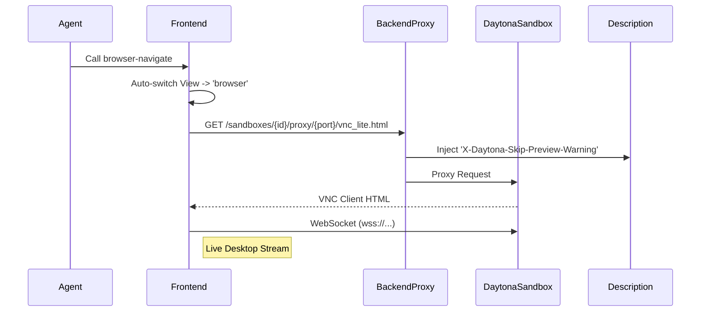

# Codemap: Kortix Computer v2 (Upstream)
Date: 2025-12-08
Source: `.portkit-cache/frontend/src/components/thread/kortix-computer/`
Target: `.portkit/specs/kortix-computer-v2/`

## 1. High-Level Architecture
The "Kortix Computer" is a sophisticated UI interface allowing agents to interact with a remote Daytona sandbox. It provides three main views:
1.  **Tools**: Visualization of agent tool execution streams.
2.  **Files**: A file explorer and viewer for the sandbox filesystem.
3.  **Browser (VNC)**: A live visual stream of the remote desktop/browser.

## 2. File Topology
```text
frontend/src/components/thread/kortix-computer/
├── KortixComputer.tsx           # [CORE] Main Container & State Manager
├── KortixComputerHeader.tsx     # Navigation & View Toggles
├── FileBrowserView.tsx          # Sandbox File Explorer Tree
├── FileViewerView.tsx           # Read-only File Content Viewer
└── index.ts                     # Public Exports

frontend/src/stores/
└── kortix-computer-store.ts     # [STATE] Zustand store for View/Path state

frontend/src/components/thread/
└── HealthCheckedVncIframe.tsx   # [COMPONENT] Robust VNC Client Wrapper
```

## 3. Dependency Graph

### Internal Dependencies
*   **State**: `useKortixComputerStore` (@/stores/kortix-computer-store)
*   **API**: `Project` (@/lib/api/threads)
*   **UI Components**: `@/components/ui/*` (Slider, Skeleton, Button, Badge)
*   **Icons**: `lucide-react`
*   **Animations**: `framer-motion`
*   **Utils**: `useIsMobile`, `getUserFriendlyToolName`

### External / Poison Dependencies
*   **`next-intl`**: Used for `useTranslations` hooks (`t('key')`).
    *   *Status*: **INCOMPATIBLE**. Must be stripped for local Suna build.
*   **`daytona-sdk`** (Backend): Required for `api.py`.

## 4. Architecture & Data Flow

### 4.1 State Management (Zustand)
The `KortixComputer` relies heavily on a global Zustand store (`useKortixComputerStore`) to manage:
*   `activeView`: 'tools' | 'files' | 'browser'
*   `selectedFilePath`: Current file open in viewer
*   `filesSubView`: 'browser' (tree) | 'viewer' (content)

### 4.2 Tool Execution Visualization
1.  **Input**: `toolCalls` prop (Array of tool executions).
2.  **Process**:
    *   `KortixComputer` snapshots tool calls.
    *   `useMemo` tracks `complete` vs `streaming` status.
    *   **Auto-Switch**: If a "Browser Tool" (e.g., `browser-navigate`) executes, the view automatically switches to `activeView: 'browser'`, triggering the VNC view.

### 4.3 VNC Streaming Flow


## 5. Critical Implementation Details

### A. VNC Preloading (`HealthCheckedVncIframe.tsx`)
*   **Purpose**: Prevents "Gray Screen" by pre-fetching the VNC URL in a hidden iframe or background process to ensure the socket is ready before the user sees it.
*   **Key Logic**: Retries connection 5 times with exponential backoff if 502/504 errors occur.

### B. File Operations
*   **Listing**: `FileBrowserView` calls `GET /api/sandboxes/{id}/files?path=...`.
*   **Reading**: `FileViewerView` calls `GET /api/sandboxes/{id}/files/content?path=...`.
*   **Note**: The backend `api.py` handles normalization of paths and potential git-history retrieval (upstream feature).

### C. Backend Proxy (`api.py`)
*   **Bypass Logic**: Upstream implementation likely lacks the specific "HTML Unescaping" and "Header Injection" logic found in the local `daytona-preview-bypass` feature.
*   **Retry Logic**: Upstream `api.py` includes detailed `retry_with_backoff` logic for File System operations that isn't present in the local version yet.

## 6. Porting Recommendations
1.  **State**: Copy `kortix-computer-store.ts` as-is.
2.  **UI**: Copy `KortixComputer.tsx` but **strip next-intl**. Replace `t('noActionsYet')` with hardcoded strings.
3.  **Backend**: MERGE upstream `api.py` to get the `retry_with_backoff` improvements, but **preserve** the local `proxy_daytona_preview` function (marked with feature tags).
