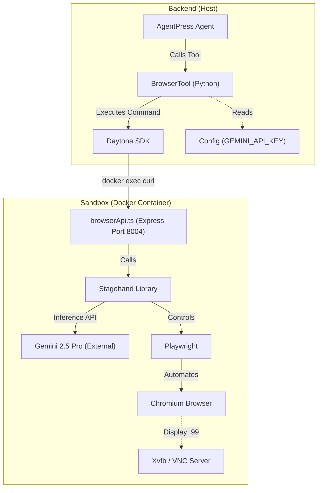

# Browser Agent System Codemap

This document maps out the "Mini Browser Agent" system, detailing how the backend communicates with the sandbox browser, the role of Stagehand/LLMs, and the underlying architecture.

## 1. High-Level Architecture

The system uses a **Dual-LLM Architecture**:
1.  **Backend Agent (High-Level)**: The main Suna agent (AgentPress) decides *when* to use the browser (e.g., "I need to log into GitHub").
2.  **Stagehand Agent (Low-Level)**: A specialized "mini-agent" running inside the sandbox (via the Stagehand library) that figures out *how* to interact with the specific page elements (e.g., "Find the button with ID 'login' and click it") using standard AI models (Gemini 2.5 Pro).

### Architecture Diagram



## 2. File Structure

### ⭐ CRITICAL Files

| File | Location | Purpose |
|------|----------|---------|
| **browserApi.ts** | `backend/core/sandbox/docker/browserApi.ts` | The "Mini Agent" server. Express app that wraps Stagehand and controls the browser. |
| **BrowserTool** | `backend/core/tools/browser_tool.py` | The backend interface. Uses `curl` to talk to `browserApi` inside the sandbox. |
| **supervisord.conf** | `backend/core/sandbox/docker/supervisord.conf` | Process manager. Ensures `browserApi` and X11/VNC are always running. |

### Comprehensive Tree

```text
backend/
├── core/
│   ├── tools/
│   │   └── browser_tool.py          # ⭐ Backend Tool Definition
│   │       ├── browser_navigate_to
│   │       ├── browser_act
│   │       └── browser_extract
│   │       └── _check_stagehand_api_health (Handles Init)
│   └── sandbox/
│       └── docker/
│           ├── browserApi.ts        # ⭐ Sandbox API Server
│           ├── package.json         # Dependencies (@browserbasehq/stagehand)
│           └── supervisord.conf     # ⭐ Process Configuration
```

## 3. Communication Flow

The backend does **not** talk to the browser directly over a network socket. Instead, it uses **Docker Execution** (`docker exec`) to run local commands inside the container.

### Step-by-Step Flow

1.  **Initialization**:
    *   Backend reads `GEMINI_API_KEY` from `backend/.env`.
    *   Backend sends `POST /api/init` command to `browserApi` passing the key securely.
    *   `browserApi` initializes `Stagehand` with this key.
    
2.  **Action Execution** (e.g., "Click Login"):
    *   **BrowserTool** constructs a `curl` command:
        ```bash
        curl -X POST http://localhost:8004/api/act \
             -d '{"action": "Click Login"}'
        ```
    *   **Daytona SDK** executes this command inside the container.
    *   **browserApi** receives the request.
    *   **Stagehand** takes the "Click Login" string and the current page DOM.
    *   **Stagehand** sends DOM + Instruction to **Gemini 2.5 Pro**.
    *   **Gemini** returns the selector/action.
    *   **Playwright** executes the click.
    *   **browserApi** captures a screenshot and returns the result JSON.

3.  **Result Handling**:
    *   `browserApi` returns JSON with `status: success` and `screenshot_base64`.
    *   `BrowserTool` parses the JSON, uploads the screenshot to S3 (if configured) or returns it to the main agent.

## 4. Component Deep Dive

### A. The "Mini Agent" (`browserApi.ts`)
This is a standard Express.js server kept alive by `supervisord`.
-   **Dependencies**: `express`, `@browserbasehq/stagehand`
-   **Model**: Hardcoded to `google/gemini-2.5-pro` (fast, multimodal).
-   **Endpoints**:
    -   `POST /api/init`: Receives API key and initializes Stagehand.
    -   `POST /api/navigate`: calls `page.goto()`.
    -   `POST /api/act`: calls `page.act()` (AI-driven).
    -   `POST /api/extract`: calls `page.extract()` (AI-driven).
    -   `POST /api/screenshot`: calls `page.screenshot()`.

### B. The Backend Tool (`browser_tool.py`)
Provides the bridge between AgentPress and the Sandbox.
-   **Error Handling**: Retry logic if `browserApi` is not ready (connection refused).
-   **Auto-Healing**: If `browserApi` is reachable but uninitialized, it automatically calls `/api/init` with the key.
-   **Security**: API keys are passed via environment variables in the exec command, not logged in plain text.

## 5. Configuration & Credentials

The system relies on the **GEMINI_API_KEY** to power the Stagehand agent. This is separate from the main agent's LLM key.

| Component | Responsibility | Source |
|-----------|----------------|--------|
| **backend/.env** | Defines the key | `GEMINI_API_KEY=...` |
| **core.utils.config** | Loads the key | `config.GEMINI_API_KEY` |
| **BrowserTool** | Transmits the key | Passes via env var in `docker exec` during init |
| **browserApi.ts** | Uses the key | Initializes `Stagehand({ apiKey: ... })` |

**Security Note**: The API key is **never** hardcoded in the frontend or the sandbox image. It is injected at runtime only when the tool is used.

## 6. Why Stagehand?
Stagehand abstracts the complexity of "Grounding" (mapping natural language to DOM elements).
-   Instead of the Main Agent trying to guess XPaths (which is error-prone), it offloads this "visual reasoning" to Stagehand.
-   This makes the Main Agent more efficient (it just says "Click X") and the execution more robust.

## 7. Interaction with AgentPress
This system is exposed as a **Single Tool** (`BrowserTool`) to AgentPress.
-   The AgentPress `ThreadManager` loads this tool.
-   The LLM sees functions: `browser_navigate_to`, `browser_act`, etc.
-   It treats the browser as a black box: Input Instruction -> Output Result + Screenshot.
