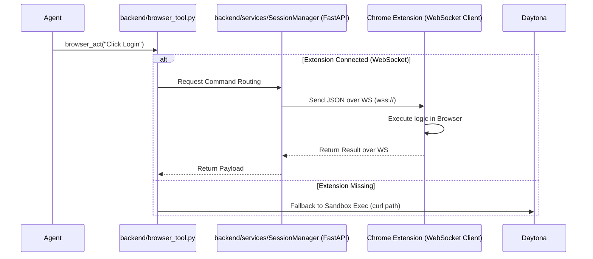

# Browser Tool System Codemap

> **Feature**: Browser Automation System (Stagehand Integration)
> **Location**: Suna Backend
> **Reference**: [research.md](.docs/chrome-extension/research.md), [plan.md](.docs/chrome-extension/plan.md)

---

## 1. File Structure (Core Files)

- `backend/core/tools/browser_tool.py`: Main Python entry point for agents. ⭐ CRITICAL
- `backend/core/sandbox/docker/browserApi.ts`: Node.js Express server running inside the sandbox (Port 8004). ⭐ CRITICAL
- `packages/kortix-chrome-extension/`: The Chrome extension meant to mirror this system.

---

## 2. File Structure (Comprehensive)

```text
backend/
├── core/
│   ├── tools/
│   │   └── browser_tool.py              # Tool metadata and Python logic ⭐ CRITICAL
│   │       └── Routes commands to sandbox (current) or extension (planned)
│   ├── sandbox/
│   │   └── docker/
│   │       └── browserApi.ts           # Remote control server inside sandbox ⭐ CRITICAL
│   │           └── Wraps @browserbasehq/stagehand via Playwright
│   └── run/
│       └── tool_manager.py              # Registers BrowserTool for agents
packages/kortix-chrome-extension/
├── src/
│   ├── background/
│   │   └── background.ts                # Main logic (to be updated for WS) ⭐ CRITICAL
│   ├── content/
│   │   └── content.ts                   # Page-level execution logic
│   └── types/
│       └── index.ts                     # Type alignment with core
```

---

### 3. Architecture & Data Flow

#### Current Implementation (Daytona Sandbox)

The sandbox implementation relies on the **Daytona SDK** as a secure command bridge rather than a direct network connection.

```mermaid
graph TD
    subgraph "Kortix Backend (Python)"
        A[Agent Task] --> B[browser_tool.py]
        B --> C[Daytona SDK client]
    end

    subgraph "Bridge (Daytona Control Plane)"
        C -- "gRPC/Process Exec" --> D[Daytona Runner]
    end

    subgraph "Daytona Sandbox (Isolated Environment)"
        D -- "Spawn Shell" --> E[curl -X POST http://localhost:8004/api/act]
        E -- "Local HTTP" --> F[browserApi.ts (Node.js)]
        F -- "Playwright Control" --> G[Chromium Browser]
        G -- "Result" --> F
        F -- "JSON Response" --> E
    end

    E -- "Stdout/Exit Code" --> D
    D -- "Result Data" --> C
    C -- "ToolResult" --> B
```

**Networking Deep Dive (Sandbox):**
1. **No Backend WebSocket**: The current system uses a synchronous **Shell-over-SDK** pattern.
2. **Isolation**: The backend never talks directly to Port 8004 over the network. It uses `self.sandbox.process.exec()` to "teleport" a `curl` command into the sandbox.
3. **Localhost Loopback**: `browserApi.ts` listens on `localhost:8004`. The `curl` command targets `localhost`. This ensures the API is never exposed to the external internet.
4. **Daytona SDK Role**: 
   - **Lifecycle**: Manages sandbox creation/deletion.
   - **Bridge**: Handles the gRPC tunnel required to execute processes and capture output.
   - **Networking**: Provides "Preview Links" (Port Forwarding) for VNC/HTTP access for human users, but is NOT the primary command path for agents.

---

#### Target Implementation (Chrome Extension)

The Chrome Extension integration transitions from a **Bridge-Shell** model to a **True WebSocket** model to handle the absence of the Daytona SDK layer on the user's local machine.



**Key Differences:**
- **Networking**: Extension uses a persistent **Full-Duplex WebSocket** (WSS) instead of Daytona's **Process-Exec Shell bridge**.
- **Latency**: Extension will likely be faster due to the direct socket connection vs. spawning a new shell/curl process for every action.
- **Persistence**: Extension solves the "Cookie Problem" because it runs in the user's actual browser profile.

---

## 4. Core Capabilities (Mirroring Targets)

The Chrome extension must implement a 1:1 mirror of these `browserApi.ts` endpoints:

| Action | Endpoint (Sandbox) | Description | Params |
|--------|-------------------|-------------|--------|
| **Navigate** | `/navigate` | Change page URL | `url` |
| **Act** | `/act` | AI-driven interaction | `action`, `iframes`, `variables`, `filePath` |
| **Extract** | `/extract` | Structured info extraction | `instruction`, `iframes` |
| **Screenshot** | `/screenshot` | Visual state capture | `name` |
| **Convert SVG** | `/convert-svg` | Capture SVG as PNG | `svg_file_path` |

---

## 5. Code Examples (Current Backend Implementation)

### 5.1 `browser_tool.py` (Python)
```python
@tool_metadata(...)
class BrowserTool(SandboxToolsBase):
    async def browser_act(self, action: str, variables: dict = None, iframes: bool = False, filePath: dict = None) -> ToolResult:
        """Perform any browser action using Stagehand."""
        params = {"action": action, "iframes": iframes, "variables": variables}
        if filePath:
            params["filePath"] = filePath
        return await self._execute_stagehand_api("act", params)
```

### 5.2 `browserApi.ts` (Node.js)
```typescript
async act(req: express.Request, res: express.Response): Promise<void> {
    const { action, iframes, variables, filePath } = req.body;
    // ... file chooser logic ...
    const result = await this.page.act({action, iframes: iframes || true, variables});
    res.json({
        success: result.success,
        message: result.message,
        url: await this.page.url(),
        screenshot_base64: ...
    });
}
```

---

## 6. Implementation Alignment

The Chrome extension's `background.ts` and `content.ts` should be updated to strictly adhere to these signatures.

**Current Shortcomings in Extension MVP**:
- Uses `extractEmails` explicitly instead of generic `extract`.
- Does not currently support the specialized `convertSvg` logic.
- `browser-router.ts` in the extension project uses similar method names but needs to be finalized as the WS client.

---

## 7. Next Steps

1. **Refactor types** in `packages/kortix-chrome-extension/src/types` to match `BrowserActionResult` and `Command` exactly.
2. **Implement `act` and `extract`** in `content.ts` using a light AI model or specialized DOM traversal if Stagehand-level AI is not present (or leverage the backend's model via the extension).
3. **Finalize WebSocket bridge** to transport these specific packets.
