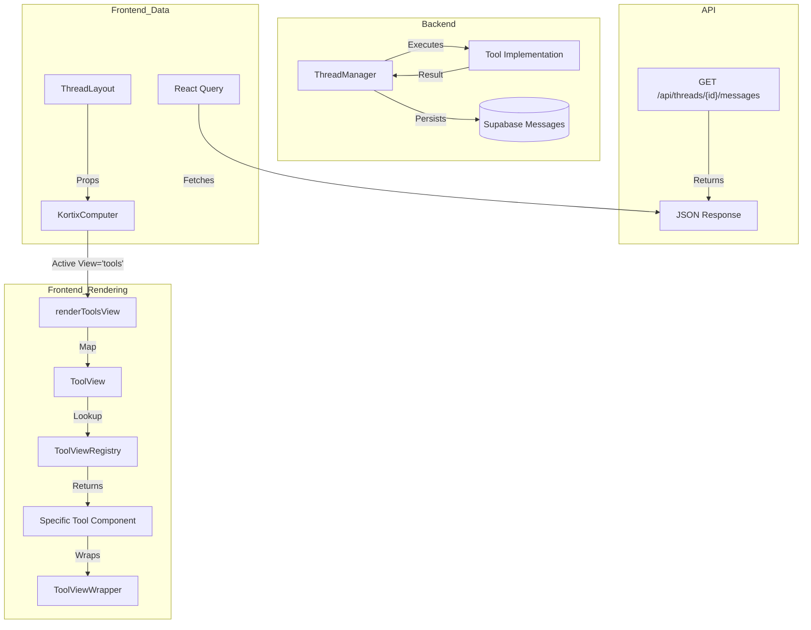

# Actions Tab (Kortix Computer) Codemap

## 1. Executive Summary

The "Actions" tab (internally referred to as the `tools` view in `KortixComputer`) is the primary visualization interface for agent activities. It renders a chronological history of tool executions, allowing users to inspect inputs, outputs, statutes, and accompanying metadata for every action performed by the backend agent.

This codemap details the end-to-end flow from backend tool execution to frontend rendering, focusing on the component hierarchy, data propagation, and view resolution logic.

## 2. Architecture Overview


## 3. Component Hierarchy & Responsibilities

### 3.1 Data Ingestion (`ThreadLayout`)
**File:** `frontend/src/components/thread/layout/thread-layout.tsx`

*   **Responsibility**: Acts as the data bridge between the global application state (messages, thread status) and the specific "Kortix Computer" UI.
*   **Key Props Passed**:
    *   `toolCalls`: Extracted list of tool execution frames (via `useThreadToolCalls`).
    *   `currentToolIndex`: Pointer to the currently active/selected tool.
    *   `agentStatus`: Current execution state (running, idle, etc.).

### 3.2 Tool Call Processing (`useThreadToolCalls`)
**File:** `frontend/src/hooks/messages/useThreadToolCalls.ts`

*   **Responsibility**: Transforms raw `UnifiedMessage[]` into a clean history of `ToolCallInput[]`.
*   **Key Logic**:
    *   **Filtering**: Explicitly filters out 'ask' and 'complete' tools (these render inline in the chat).
    *   **Pairing**: Matches `assistant` messages (intent) with `tool` messages (result) using `tool_call_id`.
    *   **ID Mapping**: Maintains `assistantMessageToToolIndex` map to enable "Jump to Action" from the chat bubble.
    *   **Streaming Updates**: Handles real-time updates for tools that are currently running (incomplete pairs).

### 3.2 View Controller (`KortixComputer`)
**File:** `frontend/src/components/thread/kortix-computer/KortixComputer.tsx`

*   **Responsibility**: Manages the visible "tab" (Actions vs Files vs Browser) and the navigation state (slider position).
*   **Key Logic**:
    *   **View Switching**: `activeView` state determines whether `renderToolsView`, `renderFilesView`, or `renderBrowserView` is called.
    *   **Navigation**: Manages `internalIndex` to allow users to scroll back through history while the agent is running.
    *   **Empty States**: Renders `<EmptyState />` if no tool calls exists.

### 3.3 Resolution Layer (`ToolViewRegistry`)
**File:** `frontend/src/components/thread/tool-views/wrapper/ToolViewRegistry.tsx`

*   **Responsibility**: Maps string identifiers (tool names) to React Components.
*   **Mapping Pattern**:
    *   Exact Match: `'execute-command' -> CommandToolView`
    *   Grouped Match: `'browser-navigate-to', 'browser-click' -> BrowserToolView`
    *   Default/Fallback: `'default' -> GenericToolView`
*   **Hook**: `useToolView(name)` retrieves the correct component.

### 3.4 Presentation Layer (`ToolView`)
**File:** `frontend/src/components/thread/tool-views/wrapper/index.ts` (exported function inside registry file)

*   **Responsibility**: The actual render container for a single action.
*   **Logic**:
    *   Normalizes tool names (e.g., handling snake_case vs kebab-case).
    *   Handles special cases (e.g., Presentation slides).
    *   Wraps the resolved component in a layout container with `contain: layout style` for performance.

### 3.5 Component Wrapper (`ToolViewWrapper`)
**File:** `frontend/src/components/thread/tool-views/wrapper/ToolViewWrapper.tsx`

*   **Responsibility**: Provides the chrome around every tool view.
*   **Elements**:
    *   **Header**: Tool icon and name.
    *   **Content**: The specific tool visualization.
    *   **Footer**: Status indicators (Success/Fail icon), timing, and duration.

## 4. Key Data Structures

### ToolCallInput Protocol
The frontend expects tool calls to adhere to this interface:
```typescript
interface ToolCallInput {
    toolCall: {
        function_name: string;
        arguments: Record<string, any>;
        tool_call_id?: string;
    };
    toolResult?: {
        success: boolean;
        output?: string;
        error?: string;
    };
    isSuccess?: boolean; // Legacy/Fallback
    timestamp?: string;
}
```

### View Types
```typescript
type ViewType = 'tools' | 'files' | 'browser';
```
*   `tools`: The default "Actions" history view.
*   `files`: The file explorer view.
*   `browser`: The VNC/Browser automation view.

### Tool Name Normalization
The system performs aggressive normalization to ensure tool names match registry keys:
1.  Replace underscores with hyphens (`browser_act` -> `browser-act`).
2.  Lowercase transformation.
3.  Pre-defined mapping check in `frontend/src/components/thread/utils.ts`.

## 5. Critical Control Flows

### 5.1 Rendering Pipeline
1.  **Ingest**: `ThreadContent` receives `messages` from the API/Socket.
2.  **Transform**: `useThreadToolCalls` hook iterates through messages:
    *   Finds `assistant` messages with `tool_calls` metadata.
    *   Finds corresponding `tool` messages with matching `tool_call_id`.
    *   Filters out excluded tools (`ask`, `complete`).
    *   Constructs `ToolCallInput` pairs (Call + Result).
3.  **Pass**: The `toolCalls` array is passed to `ThreadLayout` -> `KortixComputer`.
4.  **Select**: `KortixComputer` uses `currentIndex` to pick one `ToolCallInput`.
5.  **Resolve**: `ToolView` component resolves the tool name to a Component.
6.  **Render**: Component is rendered inside `ToolViewWrapper`.

### 5.2 Navigation Logic
*   **Live Mode**: When `agentStatus` is 'running', the UI auto-scrolls to the latest index (`totalCalls - 1`).
*   **Manual Mode**: If user interacts with the slider or Prev/Next buttons, auto-scroll is disabled.
*   **Jump to Live**: Button appears to re-enable auto-scroll.

## 6. Directory Structure

```text
frontend/src/components/thread/
├── layout/
│   └── thread-layout.tsx       # Main layout, entry point
├── kortix-computer/
│   ├── KortixComputer.tsx      # Main controller, tab management
│   ├── EmptyState.tsx          # "No actions yet" view
│   └── ...
├── tool-views/
│   ├── wrapper/
│   │   ├── ToolViewRegistry.tsx # Map: Name -> Component
│   │   ├── ToolViewWrapper.tsx  # Common UI wrapper (header/footer)
│   │   └── index.ts            # Exports
│   ├── BrowserToolView.tsx
│   ├── GenericToolView.tsx
│   └── ... (Specific tool implementations)
└── utils.ts                    # Tool name parsing and icon helpers
frontend/src/hooks/messages/
└── useThreadToolCalls.ts       # Critical logic for parsing/pairing tool calls
```

## 7. Troubleshooting "Actions Not Loading"

If the Actions tab appears blank or broken:

1.  **Check Message Pairing**: The system relies on `tool_call_id` matching between the Assistant's message metadata and the Tool/System message metadata. If IDs are missing or mismatched, `useThreadToolCalls` will drop the entry.
2.  **Check Filtering**: Ensure the tool isn't named 'ask' or 'complete' if you expect it to show in the Actions tab.
3.  **Backend Logs**: Ensure `backend/core/agentpress/thread_manager.py` is correctly saving the `tool_call_id` in the metadata.
4.  **Verify Name Mapping**: If a new tool was added, ensure it exists in `ToolViewRegistry.ts`.
5.  **Check JSON Parsing**: `frontend/src/components/thread/utils.ts` has `safeJsonParse`. If arguments are malformed strings, extraction might fail.
6.  **Enabled Debug Logs**:
    *   **Console Filter**: Filter for `[KortixComputer]` or `[useThreadToolCalls]`.
    *   **Key Logs**:
        *   `State Update`: Shows `activeView` and `toolCallsLength` to verify if the tab state is switching.
        *   `Rendering Tools View`: Confirms if the render function is entered.
        *   `Updated Tool Pairs`: Shows raw tool call data before rendering.

## 8. Active Error Mapping & Diagnosis ⭐️

This section maps active production errors to the specific architectural components defined above.

### ⭐️ Error 1: Files Tab 500 (Internal Server Error)
**Log Snippet:**
> `GET https://staging.kortix.syhc.dev/api/sandboxes/.../files?path=%2Fworkspace 500`
> `Failed to list sandbox files: Error: Error listing sandbox files: HTTP 500`

**Architectural Trace:**
1.  **UI Component:** `KortixComputer` (Active View: `files`)
2.  **Hook:** `useFiles` (in `frontend/src/hooks/files/useFiles.ts`)
3.  **API Endpoint:** `backend/core/sandbox/api.py` -> `list_files` function.
4.  **Critical Failure Point:** `sandbox.fs.list_files(path)` inside the backend.
    *   **Analysis:** The 500 indicates the Backend API was hit, but the `daytona_sdk` component failed to communicate with the Docker container, or `get_or_start_sandbox` failed.
    *   **Fix Area:** logic in `backend/core/sandbox/api.py` around lines 295-298.

### ⭐️ Error 2: VNC Preload Failure
**Log Snippet:**
> `useVncPreloader.ts:66 🔄 VNC preload failed, retrying in 2000ms (attempt 1/5)`

**Architectural Trace:**
1.  **UI Component:** `BrowserToolView` (or `KortixComputer` Browser Tab)
2.  **Sub-Component:** `HealthCheckedVncIframe.tsx`
3.  **Hook:** `useVncPreloader.ts`
4.  **Backend Target:** `backend/core/sandbox/api.py` (VNC Proxy endpoint) or direct VNC port.
    *   **Analysis:** The frontend is polling for the VNC server but getting no standard response. This usually means the browser/VNC process inside the sandbox is not running or the port is not exposed.

### ⭐️ Error 3: Auth 401 on Kong
**Log Snippet:**
> `maintenance-page.tsx:76 HEAD https://kong.kortix.syhc.dev/ 401 (Unauthorized)`

**Architectural Trace:**
1.  **Infrastructure:** Kong API Gateway / Supabase Auth
2.  **Context:** `maintenance-page.tsx` checks system health/auth.
    *   **Analysis:** The user's JWT token may be expired or missing when making the HEAD request to the Kong gateway status check. Likely a side effect, not the root cause of the Sandbox issues.
