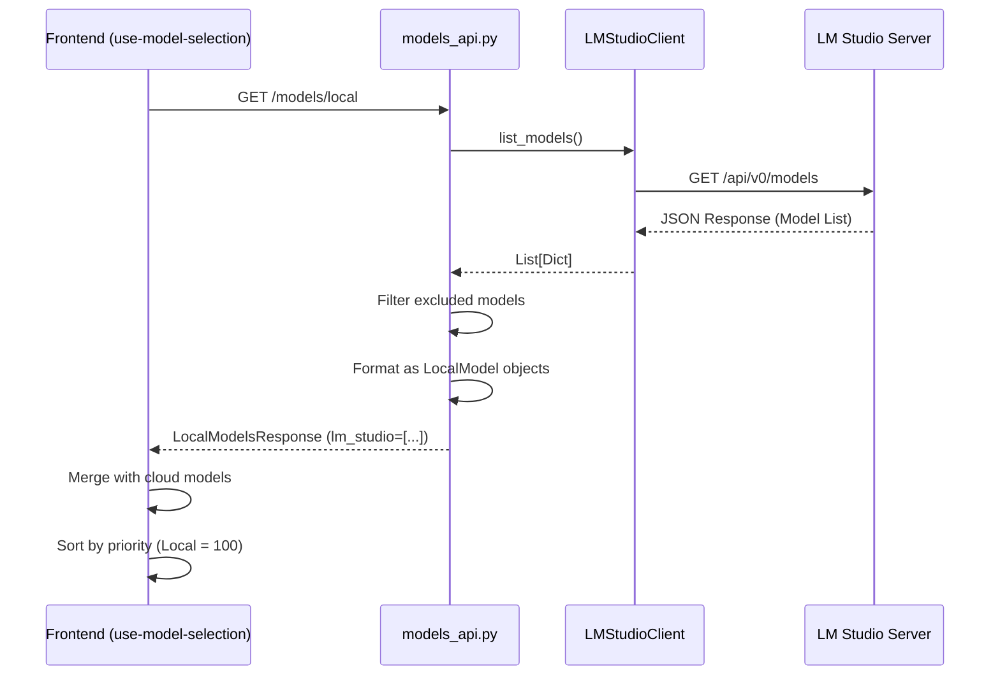
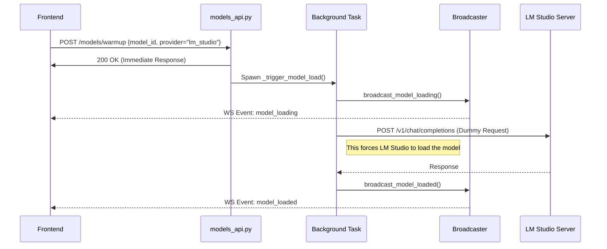
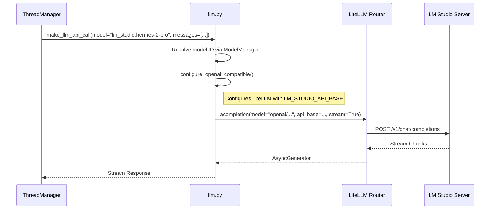

# LM Studio Client Implementation Codemap

This document provides a comprehensive technical overview of the LM Studio client implementation in the Suna Kortix platform. It covers the full stack from the frontend React components to the backend Python services, detailing how the system initializes, discovers, loads, and queries local LLMs via LM Studio.

## A. File Structure (Core Files)

The implementation is distributed across the backend and frontend. The most critical files are highlighted below.

### Backend
- **Client Wrapper**: `backend/core/ai_models/lmstudio_client.py` ⭐ CRITICAL
  - *Purpose*: Direct HTTP wrapper around LM Studio's API.
- **API Endpoints**: `backend/core/models_api.py` ⭐ CRITICAL
  - *Purpose*: FastAPI router handling model management (list, warmup, unload).
- **LLM Service**: `backend/core/services/llm.py` ⭐ CRITICAL
  - *Purpose*: Unified interface for LLM inference using LiteLLM.
- **Model Registry**: `backend/core/ai_models/registry.py`
  - *Purpose*: Registers generic OpenAI-compatible models as a fallback mechanism.

### Frontend
- **API Client**: `frontend/src/lib/api/models.ts`
  - *Purpose*: TypeScript definitions and fetch wrappers for backend endpoints.
- **State Hook**: `frontend/src/hooks/use-model-selection.ts`
  - *Purpose*: React hook managing model discovery and selection logic.

## B. File Structure (Comprehensive)

```text
suna/
├── backend/core/
│   ├── ai_models/
│   │   ├── lmstudio_client.py           # Async client for LM Studio API interactions ⭐ CRITICAL
│   │   │   └── Methods: list_models, get_model_info, unload_model
│   │   ├── registry.py                  # Model registry and fallback logic
│   │   │   └── Registers "openai-compatible/local-model"
│   │   ├── manager.py                   # High-level model management
│   │   │   └── Resolves model IDs and parameters
│   │   └── excluded_models.py           # Logic to exclude specific models
│   ├── models_api.py                    # FastAPI endpoints for model management ⭐ CRITICAL
│   │   └── Routes: /models/local, /warmup, /unload
│   ├── services/
│   │   └── llm.py                       # Unified LLM API interface (LiteLLM) ⭐ CRITICAL
│   │       └── Configures LiteLLM Router for OpenAI-compatible providers
│   └── websocket/
│       └── broadcaster.py               # Real-time status updates
│           └── Events: model_loading, model_loaded, model_load_failed
│
└── frontend/src/
    ├── lib/
    │   └── api/
    │       └── models.ts                # Frontend API client for model endpoints ⭐ CRITICAL
    │           └── Functions: getLocalModels, warmupModel, unloadModel
    └── hooks/
        └── use-model-selection.ts       # React hook for managing model selection state
            └── Merges cloud and local models into a unified list
```

## C. Architecture & Data Flow

### 1. Model Discovery Flow
**Goal**: List available models from LM Studio and expose them to the frontend.



### 2. Model Loading (Warmup) Flow
**Goal**: Pre-load a model into GPU memory to reduce latency on first request.



### 3. Completion Request Flow
**Goal**: Send a user prompt to LM Studio and stream the response.



## D. Component Deep Dive

### 1. Backend Client (`LMStudioClient`)
Located in `backend/core/ai_models/lmstudio_client.py`.

This class encapsulates all direct HTTP interactions with the LM Studio API. It handles:
- **Base URL Management**: Defaults to `http://host.docker.internal:1234` for Docker compatibility.
- **Model Listing**: Fetches models from `/api/v0/models`.
- **Metadata Extraction**: Caches model info to reduce API calls.
- **Unloading**: Explicitly unloads models to free VRAM.

**Key Methods:**
- `__init__(base_url)`: Initializes client, handles config overrides.
- `list_models()`: Returns raw model data.
- `get_model_info(model_id)`: Returns detailed metadata (context window, etc.).
- `unload_model(model_id)`: Frees GPU resources.

### 2. API Layer (`models_api.py`)
Located in `backend/core/models_api.py`.

This FastAPI router acts as the bridge between the frontend and the local LLM providers. It implements a non-blocking pattern for potentially long-running operations (like model loading) by using background tasks and WebSockets.

**Key Endpoints:**
- `GET /models/local`: Aggregates models from LM Studio and Ollama.
- `POST /models/warmup`: Triggers background loading. Returns immediately.
- `POST /models/unload`: Triggers background unloading.
- `POST /models/unload_provider`: Mass unload for provider switching.
- Fetches cloud models and local models in parallel.
- Merges them into a single list.
- **Prioritization**: Local models are given a priority of `100` to appear at the top of the list.
- **Deduplication**: Removes cloud models if a local version with the same name exists.

## E. Configuration & Environment Variables

The system relies on the following environment variables (defined in `backend/.env`):

| Variable | Default | Description |
|----------|---------|-------------|
| `LM_STUDIO_API_BASE` | `http://host.docker.internal:1234` | Base URL for LM Studio management API (listing/unloading). |
| `OPENAI_COMPATIBLE_API_BASE` | `http://host.docker.internal:1234/v1` | Base URL for LLM inference calls (OpenAI format). |
| `OPENAI_COMPATIBLE_API_KEY` | `lm-studio` | API key (usually ignored by LM Studio, but required by LiteLLM). |

> **Note**: `host.docker.internal` is used to allow the Docker container (backend) to access the LM Studio server running on the host machine.

## F. Troubleshooting

### Common Issues

1.  **Connection Refused**:
    *   *Symptom*: Backend logs show `ConnectError`.
    *   *Cause*: LM Studio server is not running or not listening on the correct port.
    *   *Fix*: Ensure LM Studio is running and the "Local Server" is started on port 1234. Check that "Cross-Origin-Resource-Sharing (CORS)" is enabled in LM Studio settings.

2.  **Model Not Found**:
    *   *Symptom*: `404 Not Found` during inference.
    *   *Cause*: The model ID in the request doesn't match the loaded model in LM Studio.
    *   *Fix*: Verify the model ID in the `/models/local` response matches what is loaded in LM Studio.

3.  **Timeout**:
    *   *Symptom*: `TimeoutException` during warmup.
    *   *Cause*: Model is too large to load within the default timeout (120s).
    *   *Fix*: Use a smaller quantization or increase the timeout in `models_api.py`.

## G. Appendix: Source Code

### 1. `backend/core/ai_models/lmstudio_client.py`

```python
"""
LM Studio API client for discovering and querying local LM Studio models.

This module provides async methods to interact with the LM Studio API
for dynamic model discovery, metadata extraction, and model management.
"""

from typing import List, Dict, Optional, Any
import httpx
from core.utils.logger import logger
from core.utils.config import config


class LMStudioClient:
    """Async client for LM Studio API interactions."""
    
    def __init__(self, base_url: Optional[str] = None):
        """
        Initialize LM Studio client.
        
        Args:
            base_url: LM Studio API base URL (e.g., http://localhost:1234)
                     If None, uses LM_STUDIO_API_BASE or defaults to localhost:1234
        """
        if base_url:
            self.base_url = base_url.rstrip('/v1').rstrip('/')
        elif hasattr(config, 'LM_STUDIO_API_BASE') and config.LM_STUDIO_API_BASE:
            logger.debug(f"Using LM_STUDIO_API_BASE: {config.LM_STUDIO_API_BASE}")
            self.base_url = config.LM_STUDIO_API_BASE.rstrip('/v1').rstrip('/')
        else:
            # Default - use host.docker.internal for Docker networking
            self.base_url = "http://host.docker.internal:1234"
        
        self._model_cache: Dict[str, Dict[str, Any]] = {}
        logger.debug(f"LMStudioClient initialized with base_url: {self.base_url}")
    
    async def list_models(self) -> List[Dict[str, Any]]:
        """
        List all available LM Studio models.
        
        Returns:
            List of model dictionaries from /api/v0/models
            
        Raises:
            httpx.HTTPError: If API request fails
        """
        url = f"{self.base_url}/api/v0/models"
        
        try:
            async with httpx.AsyncClient(timeout=10.0) as client:
                response = await client.get(url)
                response.raise_for_status()
                data = response.json()
                
                models = data.get("data", [])
                logger.info(f"Found {len(models)} LM Studio models")
                return models
                
        except httpx.HTTPError as e:
            logger.error(f"Failed to list LM Studio models: {e}")
            raise
        except Exception as e:
            logger.error(f"Unexpected error listing LM Studio models: {e}")
            raise
    
    async def get_model_info(self, model_id: str) -> Dict[str, Any]:
        """
        Get detailed information about a specific model.
        
        Args:
            model_id: ID of the model (e.g., "hermes-2-pro-mistral-7b")
            
        Returns:
            Model info dictionary from /api/v0/models/{id}
            
        Raises:
            httpx.HTTPError: If API request fails
        """
        # Check cache first
        if model_id in self._model_cache:
            logger.debug(f"Using cached model info for {model_id}")
            return self._model_cache[model_id]
        
        url = f"{self.base_url}/api/v0/models/{model_id}"
        
        try:
            async with httpx.AsyncClient(timeout=10.0) as client:
                response = await client.get(url)
                response.raise_for_status()
                model_info = response.json()
                
                # Cache the result
                self._model_cache[model_id] = model_info
                return model_info
                
        except httpx.HTTPError as e:
            logger.error(f"Failed to get LM Studio model info for {model_id}: {e}")
            raise
        except Exception as e:
            logger.error(f"Unexpected error getting LM Studio model info: {e}")
            raise
    
    async def unload_model(self, model_id: str) -> bool:
        """
        Unload a model from GPU memory.
        
        Args:
            model_id: ID of the model to unload
            
        Returns:
            True if unload was successful
            
        Raises:
            httpx.HTTPError: If API request fails
        """
        url = f"{self.base_url}/api/v0/models/unload"
        payload = {"model": model_id}
        
        try:
            async with httpx.AsyncClient(timeout=10.0) as client:
                response = await client.post(url, json=payload)
                response.raise_for_status()
                logger.info(f"Successfully unloaded model {model_id}")
                return True
                
        except httpx.HTTPError as e:
            logger.error(f"Failed to unload LM Studio model {model_id}: {e}")
            raise
        except Exception as e:
            logger.error(f"Unexpected error unloading model: {e}")
            raise
    
    async def get_context_window(self, model_id: str) -> Optional[int]:
        """
        Get the context window size for a specific LM Studio model.
        
        Args:
            model_id: ID of the model (e.g., "google/gemma-3-27b")
            
        Returns:
            Context window size in tokens, or None if not available
        """
        try:
            model_info = await self.get_model_info(model_id)
            max_context = model_info.get("max_context_length")
            
            if max_context and isinstance(max_context, int):
                logger.debug(f"LM Studio model {model_id} has context window: {max_context}")
                return max_context
            
            logger.warning(f"LM Studio model {model_id} missing max_context_length in API response")
            return None
            
        except Exception as e:
            logger.warning(f"Could not fetch context window for LM Studio model {model_id}: {e}")
            return None
    
    async def is_available(self) -> bool:
        """
        Check if LM Studio server is available.
        
        Returns:
            True if server is reachable, False otherwise
        """
        try:
            async with httpx.AsyncClient(timeout=5.0) as client:
                response = await client.get(f"{self.base_url}/api/v0/models")
                response.raise_for_status()
                return True
        except Exception as e:
            logger.debug(f"LM Studio server not available: {e}")
            return False
```

### 2. `backend/core/models_api.py` (Selected Sections)

```python
# ... imports ...

# Initialize clients
lmstudio_client = LMStudioClient()
ollama_client = OllamaClient()

def get_provider_client(provider: str):
    """Get the appropriate client for a provider."""
    if provider == "lm_studio":
        return lmstudio_client
    elif provider == "ollama":
        return ollama_client
    else:
        raise HTTPException(status_code=400, detail=f"Unknown provider: {provider}")

# ... router setup ...

async def _trigger_model_load(model_id: str, provider: str) -> None:
    """
    Background task: Load model into GPU.
    """
    load_start_time = time.time()
    _model_load_times[f"{provider}:{model_id}"] = load_start_time
    _loading_models.add(f"{provider}:{model_id}")
    
    try:
        # Broadcast: Loading started
        await broadcaster.broadcast_model_loading(
            model_id=model_id,
            provider=provider,
            estimated_time=15
        )
        
        # Get provider client and load model
        try:
            client = get_provider_client(provider)
            base_url = client.base_url
            
            # Make dummy inference request to trigger load
            async with httpx.AsyncClient(timeout=120.0) as client:
                response = await client.post(
                    f"{base_url}/v1/chat/completions",
                    json={
                        "model": model_id,
                        "messages": [{"role": "user", "content": "test"}],
                        "max_tokens": 1
                    }
                )
                response.raise_for_status()
            
            # ... success handling ...
            
        except httpx.ConnectError as e:
            # ... error handling ...
            pass
            
    
    # ... fetch Ollama models ...
    
    return LocalModelsResponse(
        lm_studio=lmstudio_models,
        ollama=ollama_models
    )
```

### 3. `frontend/src/lib/api/models.ts`

```typescript
import { backendApi } from '@/lib/api-client';

export interface LocalModel {
  id: string;          // e.g., "lm_studio:hermes-2-pro"
  name: string;        // e.g., "hermes-2-pro"
  provider: 'lm_studio' | 'ollama';
  loaded: boolean;
  context_window?: number;
  quantization?: string;
}

export interface LocalModelsResponse {
  lm_studio: LocalModel[];
  ollama: LocalModel[];
}

// ... other interfaces ...

/**
 * Fetch all available local models from LM Studio and Ollama
 */
export async function getLocalModels() {
  return backendApi.get<LocalModelsResponse>('/models/local', {
    showErrors: true,
    errorContext: {
      operation: 'getLocalModels',
      resource: 'local-models',
    },
  });
}

/**
 * Request to warmup (load) a model in LM Studio or Ollama
 */
export async function warmupModel(modelId: string) {
  return backendApi.post<{ success: boolean; message: string }>('/models/warmup', {
    model_id: modelId
  }, {
    showErrors: true,
    errorContext: {
      operation: 'warmupModel',
      resource: modelId,
    },
  });
}

/**
 * Unload a specific model
 */
export async function unloadModel(modelId: string) {
  return backendApi.post<{ success: boolean; message: string }>('/models/unload', {
    model_id: modelId
  }, {
    showErrors: true,
    errorContext: {
      operation: 'unloadModel',
      resource: modelId,
    },
  });
}
```

## H. Testing Strategy

To ensure the reliability of the LM Studio integration, the following testing strategy is recommended:

### 1. Unit Tests
- **`tests/core/ai_models/test_lmstudio_client.py`**:
  - Mock `httpx.AsyncClient` to simulate LM Studio API responses.
  - Test `list_models` with empty list, valid list, and error responses.
  - Test `get_model_info` with cache hits and misses.
  - Test `unload_model` success and failure scenarios.

### 2. Integration Tests
- **`tests/integration/test_local_models_api.py`**:
  - Spin up a mock LM Studio server (using `pytest-httpserver` or similar).
  - Test the full API flow: `GET /models/local` -> `POST /models/warmup` -> `POST /models/unload`.
  - Verify that the `models_api` router correctly delegates to the `LMStudioClient`.

### 3. Manual Verification
- **Prerequisites**:
  - LM Studio installed and running.
  - Local Server started on port 1234.
  - At least one model loaded in LM Studio.
- **Steps**:
  1.  Open the Suna Kortix frontend.
  2.  Navigate to the Chat interface.
  3.  Open the model selector.
  4.  Verify that LM Studio models appear at the top of the list (marked with "Local").
  5.  Select a model.
  6.  Send a message.
  7.  Verify that the response streams correctly.
  8.  Check LM Studio logs to confirm the request was received.

## I. Future Improvements

- **Dynamic Context Window**: Currently, we rely on `max_context_length` from the API. We could implement a fallback to a default value if the API returns `None` or an invalid value.
- **Model Parameter Tuning**: Allow users to configure temperature, top_p, and other parameters specifically for local models via the frontend.
- **Multi-Model Loading**: Support loading multiple local models simultaneously if VRAM permits (currently, we assume one active model for simplicity).
- **Automatic Server Start**: Attempt to start the LM Studio server process if it's not running (requires local installation detection).

