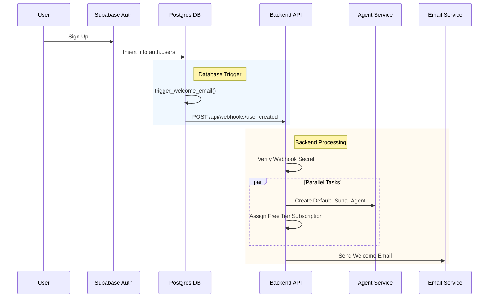

# New User Account Creation & Suna Agent Logic Codemap

This document maps out the automated system that initializes new user accounts, creates their default "Suna" agent, and sends a welcome email immediately after signup.

## A. File Structure (Core Files)

- `backend/supabase/migrations/20251113000000_welcome_email_webhook.sql` ⭐ CRITICAL (DB Trigger)
- `backend/core/setup/api.py` ⭐ CRITICAL (Webhook Handler)
- `backend/core/utils/suna_default_agent_service.py` ⭐ CRITICAL (Agent Creation Logic)
- `backend/core/suna_config.py` (Default Agent Configuration)
- `backend/core/services/email.py` (Email Service)
- `backend/core/billing/subscriptions.py` (Free Tier Assignment)

## B. File Structure (Comprehensive)

```text
backend/
├── supabase/
│   ├── migrations/
│   │   └── 20251113000000_welcome_email_webhook.sql  # 1. DB Trigger & Config Table
│   └── WEBHOOK_SETUP.md                                # Documentation for setup
├── core/
│   ├── setup/
│   │   └── api.py                                      # 2. Webhook Endpoint (/webhooks/user-created)
│   ├── utils/
│   │   └── suna_default_agent_service.py               # 3. Creates default Suna agent ⭐ CRITICAL
│   ├── suna_config.py                                  # 4. Defines default Suna agent settings
│   ├── billing/
│   │   └── subscriptions.py                            # 5. Assigns free tier subscription
│   └── services/
│       └── email.py                                    # 6. Sends welcome email
```

## C. Architecture & Data Flow

The system uses a **Database-Driven Event Architecture**. Instead of the frontend making multiple API calls after signup, the database detects the new user and notifies the backend to handle initialization.

### Data Flow Diagram



### Key Components

1.  **Database Trigger (`auth.users`)**:
    -   Monitors for new user insertions.
    -   Uses `pg_net` extension to make an asynchronous HTTP POST request to the backend.
    -   Reads configuration (URL, Secret) from `public.webhook_config` table.

2.  **Backend Webhook (`/api/webhooks/user-created`)**:
    -   Receives the user data (ID, Email, Metadata).
    -   Verifies the `X-Webhook-Secret` header against `SUPABASE_WEBHOOK_SECRET` env var.
    -   Orchestrates the setup process: Free Tier Subscription + Suna Agent Creation + Welcome Email.

3.  **Suna Agent Service (`SunaDefaultAgentService`)**:
    -   Creates a new entry in the `agents` table.
    -   Uses `SUNA_CONFIG` for default settings (Model, System Prompt, Tools).
    -   Creates the initial version (v1) of the agent using `VersionService`.

## D. Code Examples

### 1. Database Trigger Function (SQL)
*From `migrations/20251113000000_welcome_email_webhook.sql`*

```sql
CREATE OR REPLACE FUNCTION public.trigger_welcome_email()
RETURNS TRIGGER AS $$
BEGIN
  -- ... (fetch config) ...
  
  -- Make async HTTP request to backend webhook
  SELECT net.http_post(
    url := backend_url || '/api/webhooks/user-created',
    headers := jsonb_build_object(
      'Content-Type', 'application/json',
      'X-Webhook-Secret', webhook_secret
    ),
    body := payload
  ) INTO request_id;
  
  RETURN NEW;
END;
$$ LANGUAGE plpgsql SECURITY DEFINER;
```

### 2. Backend Webhook Handler (Python)
*From `core/setup/api.py`*

```python
@webhook_router.post("/webhooks/user-created", response_model=WebhookResponse)
async def handle_user_created_webhook(
    payload: SupabaseWebhookPayload,
    _: bool = Depends(verify_webhook_secret)
):
    # ... (validation) ...
    
    # Initialize account (free tier + Suna agent)
    init_result = await initialize_user_account(account_id, email)
    
    # Send welcome email asynchronously
    with concurrent.futures.ThreadPoolExecutor() as executor:
        executor.submit(_send_welcome_email_async, email, user_name)
        
    return WebhookResponse(success=True, message="Processed")
```

### 3. Agent Creation Logic (Python)
*From `core/utils/suna_default_agent_service.py`*

```python
async def _create_suna_agent_for_user(self, account_id: str) -> str:
    from core.suna_config import SUNA_CONFIG
    
    # Create agent record with default config
    agent_data = {
        "account_id": account_id,
        "name": SUNA_CONFIG["name"],
        "description": SUNA_CONFIG["description"],
        "is_default": True,
        "metadata": {
            "is_suna_default": True,
            "centrally_managed": True,
            "installation_date": datetime.now(timezone.utc).isoformat()
        },
        "version_count": 1
    }
    
    result = await client.table('agents').insert(agent_data).execute()
    agent_id = result.data[0]['agent_id']
    
    # Create initial version
    await self._create_initial_version(agent_id, account_id)
    
    return agent_id
```

### 4. Default Configuration
*From `core/suna_config.py`*

```python
SUNA_CONFIG = {
    "name": "Suna",
    "description": "Suna is your AI assistant...",
    "model": "claude-haiku-4.5",
    "system_prompt": SYSTEM_PROMPT,
    "agentpress_tools": {
        "sb_shell_tool": True,
        "web_search_tool": True,
        # ... other tools
    },
    "is_default": True
}
```

## E. Configuration

### Database Configuration
The database needs to know where the backend is. This is stored in `public.webhook_config`.

```sql
INSERT INTO public.webhook_config (backend_url, webhook_secret) 
VALUES ('http://backend:8000', 'your-secret');
```

### Environment Variables
-   **Backend**: `SUPABASE_WEBHOOK_SECRET` (Must match the secret in the database)
-   **Supabase**: `pg_net` extension must be enabled.
