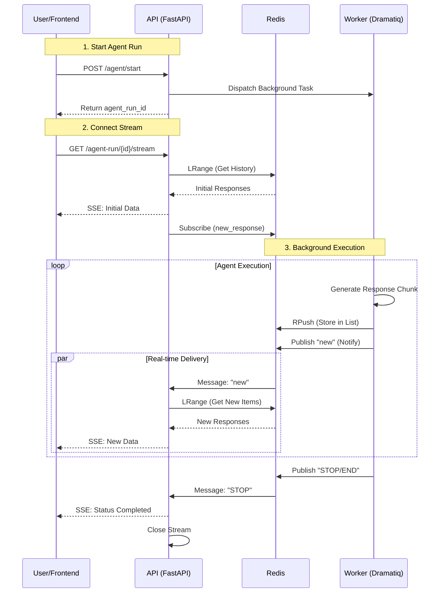

# Streaming Response Architecture Codemap

This document maps out the real-time streaming architecture used to deliver agent responses from the backend worker to the frontend user interface.

## 1. Overview

The system uses a **Redis-based Pub/Sub + List** pattern to decouple the background agent execution from the frontend streaming response. This ensures reliability, persistence of message history, and scalable real-time updates.

### Core Technologies
- **Backend**: FastAPI (`StreamingResponse`), Dramatiq (Background Worker), Redis (Asyncio)
- **Frontend**: Next.js, EventSource (Server-Sent Events), React Hooks
- **Protocol**: Server-Sent Events (SSE)

## 2. File Structure

### ⭐ CRITICAL Components

| Component | File Path | Description |
|-----------|-----------|-------------|
| **Producer** | `backend/run_agent_background.py` | Background worker that executes the agent and pushes chunks to Redis. |
| **Stream API** | `backend/core/agent_runs.py` | FastAPI endpoint that reads from Redis and streams to the client via SSE. |
| **Redis Service** | `backend/core/services/redis.py` | Wrapper for Redis operations (Pub/Sub, List push/pop). |
| **Frontend API** | `frontend/src/lib/api/agents.ts` | Client-side logic for establishing the `EventSource` connection. |
| **State Hook** | `frontend/src/hooks/threads/page/use-thread-data.ts` | React hook that manages the message state and updates the UI. |

### Comprehensive File Tree

```text
backend/
├── core/
│   ├── agent_runs.py               # 🟢 API Endpoint: /agent-run/{id}/stream
│   │   └── stream_agent_run()      # Generator function for SSE
│   └── services/
│       └── redis.py                # 🟡 Infrastructure: Redis client wrapper
└── run_agent_background.py         # 🔴 Producer: Background worker actor
    └── run_agent_background()      # Main actor loop

frontend/src/
├── lib/
│   └── api/
│       └── agents.ts               # 🔵 Client: streamAgent() with EventSource
└── hooks/
    └── threads/
        └── page/
            └── use-thread-data.ts  # 🟣 State: Consumes stream & updates UI
```

## 3. Architecture & Data Flow

### High-Level Data Flow

1.  **Trigger**: User starts an agent -> API sends task to Dramatiq worker.
2.  **Execution**: Worker (`run_agent_background`) runs the agent logic.
3.  **Production**: Worker **pushes** response chunks to a Redis List and **publishes** a notification to a Redis Channel.
4.  **Consumption**: Frontend connects to the Stream API (`/stream`).
5.  **Streaming**: Stream API **reads** from the Redis List and **subscribes** to the Redis Channel, yielding data via SSE.
6.  **Display**: Frontend `EventSource` receives events and updates React state.

### Mermaid Diagram: Streaming Flow



### Redis Keys & Channels

| Type | Key Pattern | Purpose |
|------|-------------|---------|
| **List** | `agent_run:{id}:responses` | Stores the ordered history of all response chunks. Used for initial load and catching up. |
| **Channel** | `agent_run:{id}:new_response` | Pub/Sub channel to notify listeners that new data is available in the list. |
| **Channel** | `agent_run:{id}:control` | Global control channel for signals like `STOP`, `ERROR`, `END_STREAM`. |

## 4. Code Examples

### A. Producer (Worker)
*File: `backend/run_agent_background.py`*

```python
# Inside run_agent_background actor loop
async for response in agent_gen:
    # 1. Serialize response
    response_json = json.dumps(response)
    
    # 2. Store in Redis List (Persistence)
    pending_redis_operations.append(asyncio.create_task(
        redis.rpush(response_list_key, response_json)
    ))
    
    # 3. Notify Listeners (Real-time)
    pending_redis_operations.append(asyncio.create_task(
        redis.publish(response_channel, "new")
    ))
```

### B. Stream API (FastAPI)
*File: `backend/core/agent_runs.py`*

```python
async def stream_generator(agent_run_data):
    # 1. Send existing history first
    initial_responses = await redis.lrange(response_list_key, 0, -1)
    for response in initial_responses:
        yield f"data: {json.dumps(json.loads(response))}\n\n"
        
    # 2. Subscribe to updates
    pubsub = await redis.create_pubsub()
    await pubsub.subscribe(response_channel, control_channel)
    
    # 3. Listen for new data signals
    while True:
        message = await pubsub.get_message()
        if message['channel'] == response_channel:
            # Fetch only new items since last index
            new_items = await redis.lrange(response_list_key, last_index + 1, -1)
            for item in new_items:
                yield f"data: {json.dumps(json.loads(item))}\n\n"
                last_index += 1
```

### C. Consumer (Frontend)
*File: `frontend/src/lib/api/agents.ts`*

```typescript
export const streamAgent = (agentRunId: string, callbacks: Callbacks) => {
  // 1. Connect to SSE Endpoint
  const url = new URL(`${API_URL}/agent-run/${agentRunId}/stream`);
  const eventSource = new EventSource(url.toString());

  // 2. Handle Messages
  eventSource.onmessage = (event) => {
    const data = JSON.parse(event.data);
    
    if (data.type === 'status' && data.status === 'completed') {
        callbacks.onClose(); // Handle completion
    } else {
        callbacks.onMessage(event.data); // Update UI
    }
  };
};
```

## 5. Key Implementation Details

1.  **Hybrid Push/Pull**: The system uses Pub/Sub for *notification* ("hey, there's new data") but uses the Redis List for *data retrieval*. This avoids missing messages if the subscriber disconnects briefly, as the data is persisted in the list.
2.  **Idempotency**: The worker uses a Redis lock (`agent_run_lock:{id}`) to ensure only one worker instance processes a given run.
3.  **Cleanup**: Redis keys have a TTL (24 hours) to auto-expire. The worker also explicitly cleans up locks and temporary keys on completion.
4.  **Error Handling**: Both the worker and the API have try/catch blocks to push/yield error status messages to the frontend if something fails.
