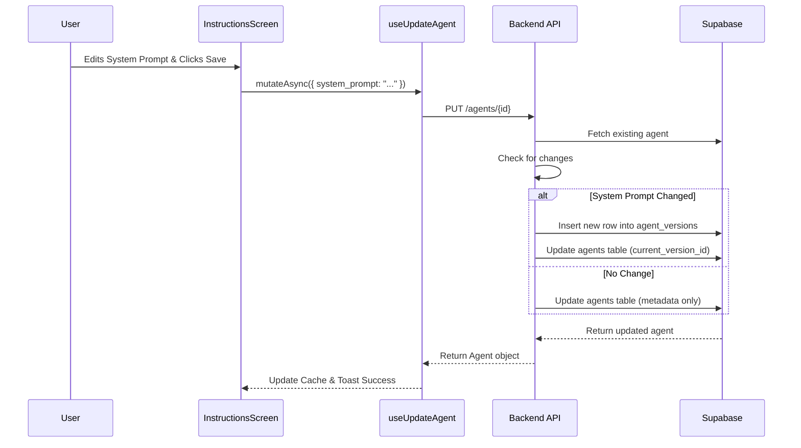

# System Prompt Page Codemap

This document maps out the technical architecture, file structure, and data flow for the "System Prompt" page within the Agent Instructions tab.

## A. File Structure (Core Files)

- **Frontend Page**: `frontend/src/app/(dashboard)/agents/config/[agentId]/screens/instructions-screen.tsx`
- **Editor Component**: `frontend/src/components/ui/expandable-markdown-editor.tsx`
- **Data Hook**: `frontend/src/hooks/agents/use-agents.ts`
- **API Utility**: `frontend/src/hooks/agents/utils.ts`
- **Backend Endpoint**: `backend/core/agent_crud.py`

## B. File Structure (Comprehensive)

```text
frontend/src/
├── app/(dashboard)/agents/config/[agentId]/screens/
│   └── instructions-screen.tsx          # Main screen component ⭐ CRITICAL
│       └── Renders the system prompt editor
├── components/ui/
│   └── expandable-markdown-editor.tsx   # Markdown editor component ⭐ CRITICAL
│       └── Handles text editing and markdown preview
├── hooks/agents/
│   ├── use-agents.ts                    # React Query hooks ⭐ CRITICAL
│   │   ├── useAgent (fetch)
│   │   └── useUpdateAgent (mutation)
│   └── utils.ts                         # API fetch wrappers
│       └── updateAgent (PUT request)
backend/core/
├── agent_crud.py                        # API Route Handlers ⭐ CRITICAL
│   └── update_agent (PUT /agents/{id})
├── api_models/
│   └── agents.py                        # Pydantic models
│       └── AgentUpdateRequest
└── versioning/
    └── version_service.py               # Version control logic
        └── create_version (called on prompt change)
```

## C. Architecture & Data Flow

### Component Interaction Flow

1.  **`InstructionsScreen`** mounts and fetches agent data using `useAgent`.
2.  It passes the `system_prompt` to **`ExpandableMarkdownEditor`**.
3.  User edits the prompt and clicks "Save".
4.  **`ExpandableMarkdownEditor`** calls `onSave` prop.
5.  **`InstructionsScreen`** calls `updateAgentMutation.mutateAsync`.
6.  **`useUpdateAgent`** triggers the API call.

### Data Flow (Frontend -> Backend)



### Key Logic

-   **Versioning**: The backend automatically creates a new version in `agent_versions` whenever the `system_prompt` is modified. This preserves history.
-   **Optimistic Updates**: The frontend uses React Query to optimistically update the UI, but relies on the backend response for the final state.
-   **Permissions**: The backend checks `metadata.restrictions` to prevent editing of Suna's default agent system prompt.

## D. Code Examples

### Frontend: Handling Save (`instructions-screen.tsx`)

```typescript
const handleSave = async (value: string) => {
    if (!isEditable) {
        // ... handle restriction
        return;
    }

    try {
        await updateAgentMutation.mutateAsync({
            agentId,
            system_prompt: value,
        });
        setSystemPrompt(value);
        toast.success('System prompt updated successfully');
    } catch (error) {
        console.error('Failed to update system prompt:', error);
        toast.error('Failed to update system prompt');
    }
};
```

### Backend: Versioning Logic (`agent_crud.py`)

```python
if values_different(agent_data.system_prompt, current_version_data.get('system_prompt')):
    needs_new_version = True
    version_changes['system_prompt'] = agent_data.system_prompt

# ...

if needs_new_version:
    new_version = await version_service.create_version(
        agent_id=agent_id,
        user_id=user_id,
        system_prompt=current_system_prompt,
        # ... other fields
        change_description="Configuration updated"
    )
```

## E. Database Schema (Relevant Tables)

### `agents`
- `agent_id` (UUID, PK)
- `current_version_id` (UUID, FK -> agent_versions)
- `metadata` (JSONB) - Stores restrictions

### `agent_versions`
- `version_id` (UUID, PK)
- `agent_id` (UUID, FK -> agents)
- `system_prompt` (Text)
- `version_number` (Integer)
