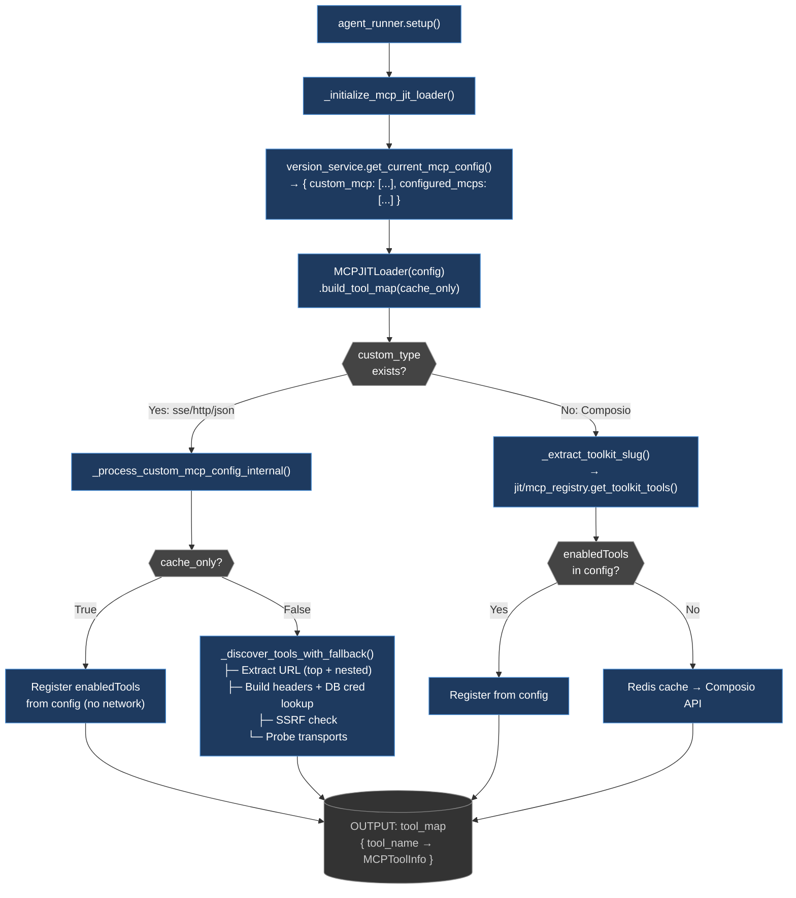
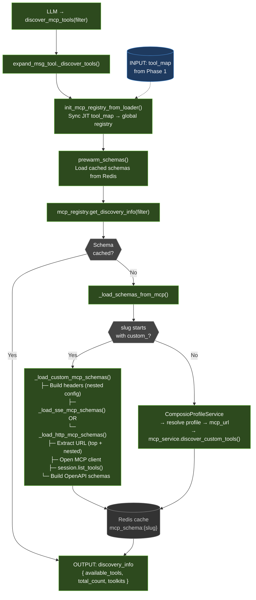
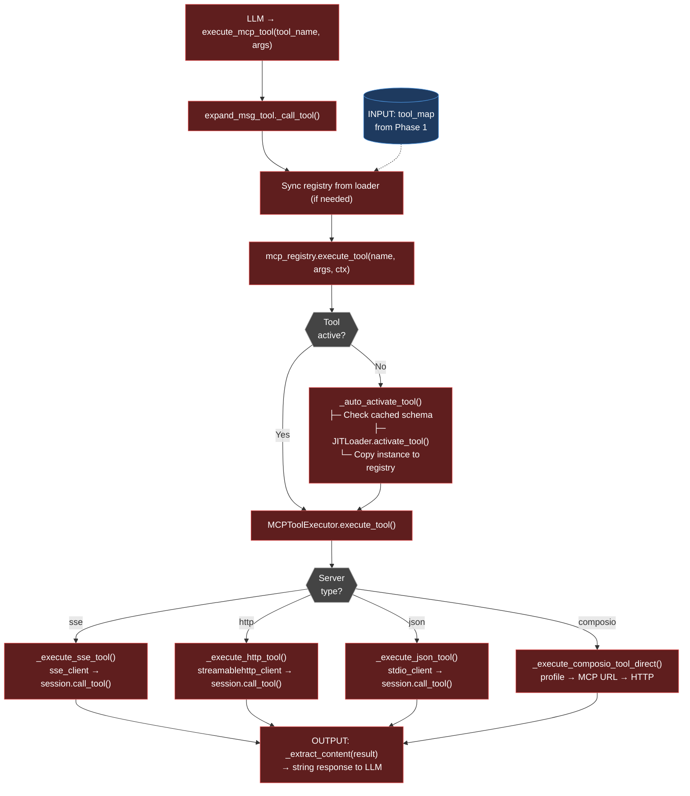
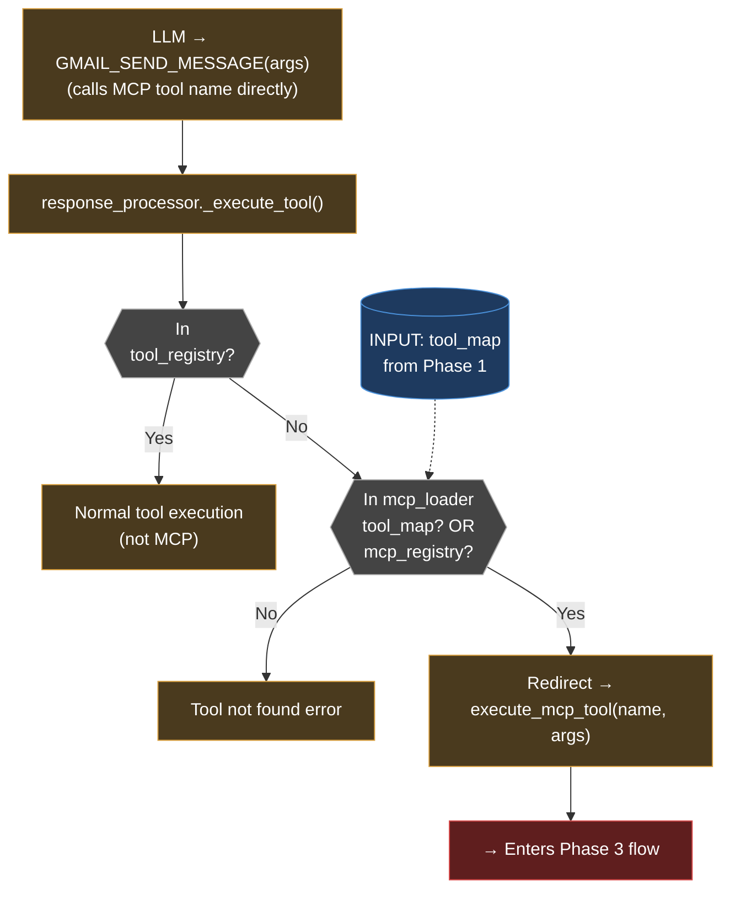
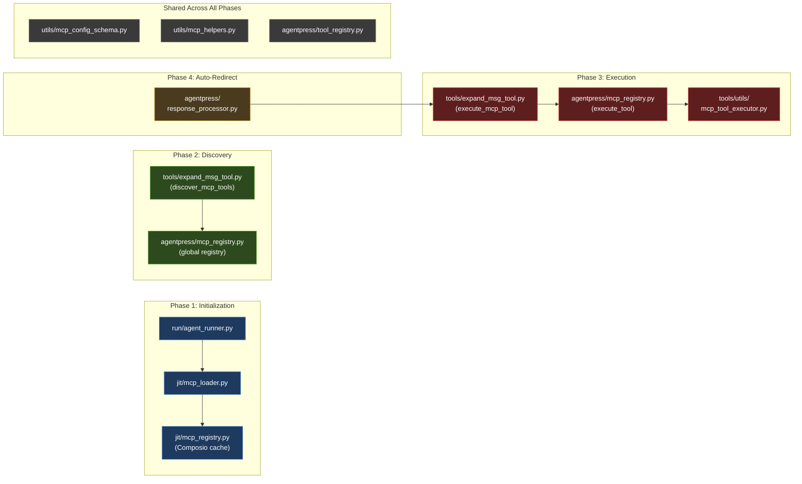

# MCP Runtime Tool Discovery & Execution Pipeline — Codemap

## Overview

The MCP runtime pipeline has four phases:
1. **Initialization** — Build the tool map at agent startup
2. **Discovery** — Load schemas on-demand when the LLM calls `discover_mcp_tools`
3. **Execution** — Dispatch the LLM's `execute_mcp_tool` call to the right transport
4. **Auto-redirect** — Intercept direct tool calls and route through the MCP pipeline

---

## Core Files

The most critical files for understanding the MCP runtime pipeline:

| File | Phase | Role |
|------|-------|------|
| `core/jit/mcp_loader.py` | 1 | ⭐ CRITICAL — Builds the tool_map at startup (URL extraction, SSRF, transport probing) |
| `core/agentpress/mcp_registry.py` | 2, 3 | ⭐ CRITICAL — Global runtime registry: schema loading, execution dispatch, Redis caching |
| `core/tools/expand_msg_tool.py` | 2, 3 | ⭐ CRITICAL — LLM-facing entry points: `discover_mcp_tools()` + `execute_mcp_tool()` |
| `core/tools/utils/mcp_tool_executor.py` | 3 | ⭐ CRITICAL — Unified executor: SSE/HTTP/JSON/Composio transport dispatch |
| `core/run/agent_runner.py` | 1 | ⭐ CRITICAL — Agent thread startup, creates JIT loader, owns initialization flow |
| `core/agentpress/response_processor.py` | 4 | Auto-redirect: intercepts direct MCP tool calls from LLM |
| `core/utils/mcp_config_schema.py` | Shared | Config normalization: camelCase ↔ snake_case, `CanonicalMCPConfig` |
| `core/utils/mcp_helpers.py` | Shared | Slug generation, config merging |

---

## File Structure (ASCII Tree — Comprehensive)

```
backend/
├── core/
│   │
│   ├── run/                              ─── AGENT STARTUP ───
│   │   ├── agent_runner.py                  Entry point. Loads config, creates JIT loader ⭐ CRITICAL
│   │   └── mcp_manager.py                   Registers MCP tools during agent execution
│   │
│   ├── jit/                              ─── JIT DISCOVERY LAYER ───
│   │   ├── mcp_loader.py                    Builds tool_map (URL extraction, SSRF, probing) ⭐ CRITICAL
│   │   ├── mcp_registry.py                  Composio-ONLY tool name cache (Redis)
│   │   └── mcp_tool_wrapper.py              Execution wrapper (SSE/HTTP/JSON dispatch)
│   │
│   ├── agentpress/                       ─── RUNTIME REGISTRY & DISPATCH ───
│   │   ├── mcp_registry.py                  Global singleton: schemas, status, execution ⭐ CRITICAL
│   │   ├── tool_registry.py                 Main tool registry (hides MCP from LLM)
│   │   └── response_processor.py            Dispatches LLM tool calls (auto-redirect) ⭐ CRITICAL
│   │
│   ├── tools/                            ─── LLM-FACING TOOLS ───
│   │   ├── expand_msg_tool.py               discover_mcp_tools() + execute_mcp_tool() ⭐ CRITICAL
│   │   ├── mcp_tool_wrapper.py              Dynamic tool wrapper for Composio/custom
│   │   └── utils/
│   │       ├── mcp_tool_executor.py          Unified executor (dual-mode: legacy+direct) ⭐ CRITICAL
│   │       ├── mcp_connection_manager.py     Connection handling for MCP servers
│   │       ├── custom_mcp_handler.py         Custom MCP initialization wrapper
│   │       └── dynamic_tool_builder.py       Dynamic schema generation from MCP servers
│   │
│   ├── mcp_module/                       ─── SERVICE LAYER (API + OAuth) ───
│   │   ├── api.py                           FastAPI router (/v1/mcp/*)
│   │   ├── mcp_service.py                   MCP connections, tool execution service
│   │   ├── custom_mcp_registry_service.py   Custom MCP discovery service
│   │   ├── auth_service.py                  OAuth2 state generation/validation
│   │   └── exceptions.py                    Exception hierarchy
│   │
│   ├── utils/                            ─── SHARED UTILITIES ───
│   │   ├── mcp_config_schema.py             camelCase <-> snake_case normalization
│   │   └── mcp_helpers.py                   merge_custom_mcps(), qualified name gen
│   │
│   └── composio_integration/             ─── COMPOSIO-SPECIFIC ───
│       └── mcp_server_service.py            Composio MCP server CRUD
│
└── tests/                                ─── TEST SUITE (143 tests) ───
    ├── test_mcp_phase1_core.py              13 tests: API, encryption, Composio
    ├── test_mcp_phase2_jit.py               22 tests: JIT loader, SSRF, Composio
    ├── test_mcp_phase3_executor.py          31 tests: Unified executor, dispatch
    ├── test_mcp_phase4_config.py            32 tests: Config normalization
    └── test_mcp_phase5_coverage.py          45 tests: Auth, registry, helpers, edge
```

### Key: Two Identically-Named Files (Different Roles!)

```
WATCH OUT — These share names but do DIFFERENT things:

  jit/mcp_registry.py          ≠   agentpress/mcp_registry.py
  ──────────────────               ──────────────────────────
  Composio tool-name cache         Global runtime registry
  Redis: mcp_tools:v1:{slug}       Redis: mcp_schema:{slug}
  Only for Composio toolkits       For ALL MCP tools (custom + Composio)

  jit/mcp_tool_wrapper.py      ≠   tools/mcp_tool_wrapper.py
  ────────────────────              ────────────────────────
  JIT execution wrapper             Dynamic tool wrapper
  SSE/HTTP/JSON dispatch            Schema caching + registration

  jit/mcp_loader.py:MCPToolInfo ≠   agentpress/mcp_registry.py:MCPToolInfo
  ──────────────────────────        ────────────────────────────────────
  Lightweight index entry            Full runtime entry with exec tracking
  Fields: tool_name, slug,          Fields: tool_name, slug, mcp_config,
          mcp_config, loaded,                status, schema, instance,
          schema, load_time_ms               call_count, last_error, ...
```

---

## Mermaid: Phase 1 — Initialization (Agent Startup)

**Files:** `run/agent_runner.py` → `jit/mcp_loader.py` → `jit/mcp_registry.py`
**Output:** `tool_map { tool_name → MCPToolInfo }` — consumed by Phases 2, 3, and 4.



## Mermaid: Phase 2 — Discovery (LLM calls `discover_mcp_tools`)

**Files:** `tools/expand_msg_tool.py` → `agentpress/mcp_registry.py`
**Input:** `tool_map` from Phase 1. **Output:** `discovery_info` with schemas for LLM.



## Mermaid: Phase 3 — Execution (LLM calls `execute_mcp_tool`)

**Files:** `tools/expand_msg_tool.py` → `agentpress/mcp_registry.py` → `tools/utils/mcp_tool_executor.py`
**Input:** `tool_name` + `args` from LLM. **Output:** string result back to LLM.



## Mermaid: Phase 4 — Auto-Redirect (LLM calls MCP tool by name directly)

**Files:** `agentpress/response_processor.py` → redirects into Phase 3.
**Trigger:** LLM emits a raw MCP tool name (e.g. `GMAIL_SEND_MESSAGE`) instead of calling `execute_mcp_tool`.



---

## Mermaid: File Ownership by Phase



---

## ⚠️ Two `MCPToolInfo` Classes (Different!)

| Location | Fields | Purpose |
|----------|--------|---------|
| `jit/mcp_loader.py:18` | `tool_name, toolkit_slug, mcp_config, loaded, schema, load_time_ms` | Lightweight JIT index entry |
| `agentpress/mcp_registry.py:21` | `tool_name, toolkit_slug, mcp_config, status, schema, instance, call_count, last_error, ...` | Full runtime registry entry with execution tracking |

Converted in `init_mcp_registry_from_loader()` (agentpress/mcp_registry.py:723).

## ⚠️ Two `MCPRegistry` Classes (Different!)

| Location | Purpose | Redis Key Pattern |
|----------|---------|-------------------|
| `jit/mcp_registry.py:11` | Caches Composio toolkit tool-NAME lists | `mcp_tools:v1:{slug}` |
| `agentpress/mcp_registry.py:51` | Runtime registry with full schemas + execution dispatch | `mcp_schema:{slug}` |

---

## File-by-File Reference

### 1. `backend/core/utils/mcp_config_schema.py` — Config Key Normalization

| Function | Line | Purpose |
|----------|------|---------|
| `get_config_value(config, key, default)` | 67 | Safe accessor: tries snake_case → camelCase → bare `"type"`. Does **NOT** handle nesting. |
| `normalize_to_snake(config)` | 31 | Dict transform: camelCase keys → snake_case |
| `normalize_to_camel(config)` | 49 | Dict transform: snake_case keys → camelCase |
| `CanonicalMCPConfig.from_raw(raw)` | 102 | Builds typed dataclass from any-format dict |
| `CanonicalMCPConfig.to_storage()` | 115 | Serializes back to camelCase for DB |

**⚠️ `get_config_value` only handles camelCase/snake_case — NOT the nested `config.config` pattern. Every consumer handles nesting manually.**

### 2. `backend/core/utils/mcp_helpers.py` — Shared Utilities

| Function | Line | Purpose |
|----------|------|---------|
| `merge_custom_mcps(existing, new)` | 5 | Dedup-merge two MCP config lists by `qualifiedName` or `name` |
| `get_custom_mcp_qualified_name(url, type)` | 51 | Generates `custom_{type}_{md5(url)[:8]}` slug |

### 3. `backend/core/run/agent_runner.py` — Agent Thread Startup

| Method | Line | Purpose |
|--------|------|---------|
| `setup()` | 171 | Creates ThreadManager, calls `_initialize_mcp_jit_loader()` |
| `_initialize_mcp_jit_loader(cache_only)` | 708 | Loads fresh MCP config from DB, creates `MCPJITLoader`, calls `build_tool_map()` |
| `_enrichment_phase_b()` | 130 | Retries with `cache_only=False` if first pass found 0 tools |

**Initialization flow:**
```
agent_runner.setup()
  → _initialize_mcp_jit_loader()
    → version_service.get_current_mcp_config(agent_id, account_id)
    → Returns { 'custom_mcp': [...], 'configured_mcps': [...] }
    → MCPJITLoader(mcp_config)
    → build_tool_map(cache_only=True/False)
    → Stores as thread_manager.mcp_loader
```

### 4. `backend/core/jit/mcp_loader.py` — JIT Tool Map Builder

| Method | Line | Purpose |
|--------|------|---------|
| `build_tool_map(cache_only, force_rebuild)` | 94 | Reads `custom_mcp` + `configured_mcps`, processes each in parallel |
| `_process_mcp_config(cfg, type, cache_only)` | 150 | Routes to custom or Composio processing based on `custom_type` |
| `_process_custom_mcp_config_internal(cfg, cache_only)` | 219 | Handles `sse`/`http`/`json` custom MCPs |
| `_extract_toolkit_slug(cfg)` | 414 | Tries: `toolkit_slug` → `qualifiedName.split('.')[-1]` → nested config |
| `_discover_tools_with_fallback(cfg)` | 292 | Full discovery: URL extraction, SSRF, header building, transport probing |
| `activate_tool(tool_name)` | 461 | Lazy-loads full schema for a single tool |
| `_load_tool_schema(tool_name, tool_info)` | 531 | Dispatches schema loading by `customType` |

**URL extraction (line 223, 294):**
```python
url = mcp_config.get('url') or mcp_config.get('config', {}).get('url')  # ✅ Handles nesting
```

**Header building in `_discover_tools_with_fallback` (lines 306-337):**
1. `headers = config.get('headers') or config.get('config', {}).get('headers') or {}`
2. `access_token = config.get('access_token') or config.get('config', {}).get('access_token')`
3. If no token: DB credential lookup via `qualifiedName` + `account_id`
4. Merge `custom_headers`
5. SSRF check on URL

**`cache_only=True` behavior:**
- Registers only `enabledTools` from config (no network calls)
- If no `enabledTools`: skips entirely, defers to later discovery

### 5. `backend/core/jit/mcp_registry.py` — Composio Tool Name Cache

| Method | Line | Purpose |
|--------|------|---------|
| `get_toolkit_tools(slug, account_id, cache_only)` | 37 | Redis cache → Composio API discovery |
| `warm_cache_for_agent_toolkits(config)` | 328+ | Background cache warming for all toolkits |

**Only used for Composio toolkits, NOT custom MCP servers.**

### 6. `backend/core/agentpress/mcp_registry.py` — Runtime Registry

| Method | Line | Purpose |
|--------|------|---------|
| `register_tool_info(info)` | 67 | Adds to `_tools`, `_toolkit_mapping`, `_status_index` |
| `get_discovery_info(filter, load_schemas, account_id)` | 176 | Returns available tools with schemas for the LLM |
| `_load_schemas_from_mcp(tool_names, account_id)` | 223 | Loads full schemas; custom vs Composio routing |
| `_load_custom_mcp_schemas(type, config)` | 376 | Builds headers, dispatches to SSE/HTTP/JSON loaders |
| `_load_sse_mcp_schemas(config, headers)` | 416 | Opens `sse_client`, `list_tools()`, builds schemas |
| `_load_http_mcp_schemas(config, headers)` | 486 | Opens `streamablehttp_client`, `list_tools()`, builds schemas |
| `execute_tool(name, args, context)` | 576 | Dispatches execution via tool instance |
| `_auto_activate_tool(name, context)` | 625 | Lazy-activates via JIT loader |
| `prewarm_schemas(account_id)` | 675 | Loads cached schemas from Redis |
| `init_mcp_registry_from_loader(loader)` | 723 | Converts JIT `tool_map` → runtime registry entries |

**Custom vs Composio decision (line 239):**
```python
if toolkit_slug.startswith("custom_"):  → custom MCP path
else:                                   → Composio path
```

**URL extraction in SSE/HTTP loaders (lines 418, 488):**
```python
url = config.get('url') or config.get('config', {}).get('url')  # ✅ Fixed
```

**Header building in `_load_custom_mcp_schemas` (lines 381-392):**
```python
config_nested = config.get('config', {})
headers = config.get('headers') or config_nested.get('headers') or {}
access_token = config.get('access_token') or config_nested.get('access_token')
custom_headers = config.get('custom_headers') or config_nested.get('custom_headers')
```

### 7. `backend/core/tools/expand_msg_tool.py` — LLM-Facing Tool

| Method | Line | Purpose |
|--------|------|---------|
| `discover_mcp_tools(filter)` | 109 | Entry point for LLM discovery calls |
| `_discover_tools(filter)` | 277 | Syncs registry from loader, prewarmes, calls `get_discovery_info()` |
| `execute_mcp_tool(tool_name, args)` | 134 | Entry point for LLM execution calls |
| `_call_tool(tool_name, args)` | 306 | Syncs registry, creates context, calls `registry.execute_tool()` |

**Discovery flow:**
```python
# Line 277-304
mcp_registry = get_mcp_registry()
mcp_loader = self.thread_manager.mcp_loader
if not initialized or loader has more tools:
    init_mcp_registry_from_loader(mcp_loader)   # Sync JIT → registry
    prewarm_schemas(account_id)                   # Redis → registry
discovery_info = mcp_registry.get_discovery_info(filter, load_schemas=True)
return discovery_info
```

### 8. `backend/core/agentpress/tool_registry.py` — Main Tool Registry

| Method | Line | Purpose |
|--------|------|---------|
| `register_tool(cls, names, **kwargs)` | 13 | Creates tool instance, stores with schema |
| `get_available_functions()` | 56 | Returns `{name: callable}` dict for dispatch |
| `get_openapi_schemas()` | 81 | Returns schemas for LLM — **filters OUT MCP tools** |

**MCP tools are hidden from direct LLM schemas.** The LLM only sees `discover_mcp_tools` and `execute_mcp_tool`.

### 9. `backend/core/agentpress/response_processor.py` — Tool Call Dispatch

| Method | Line | Purpose |
|--------|------|---------|
| `_execute_tool(tool_call)` | 2324 | Dispatches LLM function calls |

**Auto-redirect flow (lines 2347-2378):**
```
LLM calls "GMAIL_SEND_MESSAGE" directly
  → Not in tool_registry (MCP tools are hidden)
  → Check mcp_loader.tool_map → FOUND
  → OR check mcp_registry → FOUND
  → Get execute_mcp_tool from available_functions
  → Call: execute_mcp_tool("GMAIL_SEND_MESSAGE", args)
  → Continues through normal execution path
```

### 10. `backend/core/tools/utils/mcp_tool_executor.py` — Unified Executor

| Method | Line | Purpose |
|--------|------|---------|
| `__init__(custom_tools, tool_wrapper)` | 30 | Legacy constructor |
| `from_mcp_config(mcp_config)` | 44 | JIT/direct constructor |
| `build_headers(mcp_config)` | 68 | Static canonical header builder |
| `execute_tool(name, args)` | 96 | Main dispatch: direct or legacy mode |
| `_execute_direct(name, args)` | 115 | Direct-mode dispatch by server type |
| `_execute_sse_tool(name, args, info)` | 241 | SSE transport execution |
| `_execute_http_tool(name, args, info)` | 285 | HTTP streamable transport execution |
| `_execute_json_tool(name, args, info)` | 319 | stdio transport execution |
| `_execute_composio_tool_direct(name, args)` | 202 | Composio profile → MCP URL → HTTP |
| `_extract_content(result)` | 382 | Converts MCP CallToolResult → string |

**URL extraction in executor (line 241+):**
```python
url = custom_config.get('url') or self.mcp_config.get('url')  # ✅ Handles nesting
```

---

## Code Examples — Critical Patterns

The most important code patterns across the pipeline. These illustrate the core logic that makes the system work (and the patterns that caused bugs when done wrong).

### Nested Config URL Extraction (safe pattern — used in all 3 layers)

```python
# jit/mcp_loader.py:223, agentpress/mcp_registry.py:418, tools/utils/mcp_tool_executor.py:241
url = mcp_config.get('url') or mcp_config.get('config', {}).get('url')
```

### Header Building With Credential Fallback (jit/mcp_loader.py:306-337)

```python
headers = config.get('headers') or config.get('config', {}).get('headers') or {}
access_token = config.get('access_token') or config.get('config', {}).get('access_token')

# DB credential fallback if no token in config
if not access_token:
    qualified_name = config.get('qualifiedName') or config.get('qualified_name')
    if qualified_name and account_id:
        cred = await credential_service.get_credential(qualified_name, account_id)
        if cred:
            access_token = cred.get('access_token')

if access_token:
    headers['Authorization'] = f'Bearer {access_token}'

# Merge custom_headers last (highest priority)
custom_headers = config.get('custom_headers') or config.get('config', {}).get('custom_headers')
if custom_headers:
    headers.update(custom_headers)
```

### Custom vs Composio Routing Decision (agentpress/mcp_registry.py:239)

```python
if toolkit_slug.startswith("custom_"):
    # Custom MCP path → SSE/HTTP/JSON transport
    await self._load_custom_mcp_schemas(custom_type, mcp_config)
else:
    # Composio path → profile resolution → MCP URL
    profile_service = ComposioProfileService()
    profile = await profile_service.resolve_profile(toolkit_slug, account_id)
    mcp_url = profile.get('mcp_url')
    schemas = await mcp_service.discover_custom_tools(mcp_url)
```

### Auto-Redirect: Intercepting Direct MCP Tool Calls (response_processor.py:2347-2378)

```python
# LLM called "GMAIL_SEND_MESSAGE" directly (not via execute_mcp_tool)
if tool_name not in available_functions:
    # Check if it's a known MCP tool
    mcp_loader = thread_manager.mcp_loader
    mcp_registry = get_mcp_registry()

    if (mcp_loader and tool_name in mcp_loader.tool_map) or \
       (mcp_registry and mcp_registry.has_tool(tool_name)):
        # Redirect through the standard MCP execution path
        execute_fn = available_functions.get('execute_mcp_tool')
        result = await execute_fn(tool_name=tool_name, arguments=json.dumps(arguments))
```

### JIT cache_only=True Behavior (jit/mcp_loader.py:219-260)

```python
# Phase 1 fast path: register from config without network calls
if cache_only:
    enabled_tools = config.get('enabledTools') or config.get('enabled_tools') or []
    if enabled_tools:
        for tool_name in enabled_tools:
            self.tool_map[tool_name] = MCPToolInfo(
                tool_name=tool_name,
                toolkit_slug=slug,
                mcp_config=config,  # Full raw config preserved for later phases
                loaded=False,
                schema=None
            )
    # If no enabledTools: skip entirely, defer to Phase 2 discovery
    return
```

---

## Config Nesting — The Root Cause of Bugs

```
MCP config objects arrive from frontend/DB with values at TWO levels.
Every consumer must check BOTH or it will silently miss the URL/token.

┌─────────────────────────────────────────────────────────┐
│  TOP LEVEL (sometimes populated)                        │
│  ─────────────────────────────                          │
│  config["name"]           = "Valyu Research Tools"      │
│  config["type"]           = "sse"                       │
│  config["url"]            = <MISSING or present>        │
│  config["access_token"]   = <MISSING or present>        │
│  config["headers"]        = <MISSING or present>        │
│  config["enabledTools"]   = ["valyu_search", ...]       │
│  config["qualifiedName"]  = "custom_sse_1771203398774"  │
│                                                         │
│  ┌─────────────────────────────────────────────────┐    │
│  │  NESTED: config["config"] (usually populated)   │    │
│  │  ─────────────────────────────────────────────   │    │
│  │  config["config"]["url"]            = "https:.." │ ◄── THE ACTUAL URL
│  │  config["config"]["access_token"]   = "sk-..."   │    │
│  │  config["config"]["headers"]        = {...}      │    │
│  │  config["config"]["requires_config"] = false     │    │
│  │  config["config"]["toolkit_slug"]   = "custom.." │    │
│  └─────────────────────────────────────────────────┘    │
│                                                         │
│  SAFE PATTERN:                                          │
│  url = config.get('url') or config.get('config',{}).get('url')
│                                                         │
│  BUG PATTERN (what we fixed):                           │
│  url = config.get('url')   ← misses nested URL!        │
└─────────────────────────────────────────────────────────┘
```

---

## Complete Data Flow Diagrams (Text)

### Phase 1: Initialization (Agent Startup)

```
agent_runner.setup()
  │
  ▼
_initialize_mcp_jit_loader()
  │ Loads: version_service.get_current_mcp_config()
  │ Returns: { 'custom_mcp': [...], 'configured_mcps': [...], 'account_id': ... }
  │
  ▼
MCPJITLoader(mcp_config).build_tool_map(cache_only=True)
  │
  ├── For each custom MCP (type="sse"/"http"/"json"):
  │     └── _process_custom_mcp_config_internal()
  │           ├── cache_only=True: register enabledTools directly (no network)
  │           └── cache_only=False: _discover_tools_with_fallback()
  │                 ├── Extract URL (top-level or nested)
  │                 ├── Build headers (access_token, custom_headers, DB lookup)
  │                 ├── SSRF check
  │                 ├── Probe: [preferred, fallback] x [url, url/mcp]
  │                 └── Returns: List[str] tool names
  │
  ├── For each Composio MCP:
  │     └── _extract_toolkit_slug()
  │           ├── If enabledTools in config → register directly
  │           └── Else: jit.mcp_registry.get_toolkit_tools()
  │                 ├── Redis cache check
  │                 └── Composio profile lookup + MCP discovery
  │
  ▼
tool_map = { "tool_name": MCPToolInfo(mcp_config=FULL_RAW_CONFIG), ... }
```

### Phase 2: Discovery (LLM calls `discover_mcp_tools`)

```
LLM → discover_mcp_tools(filter="valyu_search,valyu_academic_search")
  │
  ▼
expand_msg_tool._discover_tools(filter)
  │
  ├── Get global MCPRegistry singleton
  ├── Sync: init_mcp_registry_from_loader(mcp_loader)
  │     └── For each tool in loader.tool_map:
  │           Create agentpress.MCPToolInfo(mcp_config=loader_info.mcp_config)
  │           Register in registry._tools and _toolkit_mapping
  ├── prewarm_schemas() → check Redis for cached schemas
  │
  ▼
mcp_registry.get_discovery_info(filter, load_schemas=True)
  │
  ├── Parse filter, look up tools in _tools dict
  ├── For tools without schema → _load_schemas_from_mcp()
  │     │
  │     ├── Custom (slug starts with "custom_"):
  │     │     ├── Check Redis cache first
  │     │     ├── _load_custom_mcp_schemas(type, mcp_config)
  │     │     │     ├── Build headers from config + nested config
  │     │     │     └── _load_sse_mcp_schemas() or _load_http_mcp_schemas()
  │     │     │           ├── Extract URL (top-level or nested)
  │     │     │           ├── Open MCP client → session.list_tools()
  │     │     │           └── Build OpenAPI schema for each tool
  │     │     └── Cache result to Redis
  │     │
  │     └── Composio:
  │           ├── ComposioProfileService → resolve profile → mcp_url
  │           └── mcp_service.discover_custom_tools() → schemas
  │
  ▼
Returns: {
  "available_tools": { "valyu_search": {schema}, ... },
  "total_count": N,
  "toolkits": ["google_drive", "custom_sse_1771203398774"],
  "filter_applied": "valyu_search,valyu_academic_search"
}
```

### Phase 3: Execution (LLM calls `execute_mcp_tool`)

```
LLM → execute_mcp_tool(tool_name="valyu_search", args={...})
  │
  ▼
expand_msg_tool._call_tool("valyu_search", args)
  │
  ├── Sync registry from loader (if needed)
  ├── Create MCPExecutionContext(thread_manager)
  │
  ▼
mcp_registry.execute_tool("valyu_search", args, context)
  │
  ├── Lookup tool_info in _tools
  ├── If not active: _auto_activate_tool()
  │     ├── Check cached schema
  │     ├── JITLoader.activate_mcp_tool() → registers in tool_registry
  │     └── Copy instance to MCP registry
  │
  ▼
tool_info.instance.execute_tool("valyu_search", args)
  │
  ▼
MCPToolExecutor.execute_tool()
  ├── _execute_direct() if direct mode
  │     └── Build tool_info with custom_config
  └── Dispatch by server_type:
        ├── "sse"  → _execute_sse_tool()  → sse_client → session.call_tool()
        ├── "http" → _execute_http_tool() → streamablehttp_client → session.call_tool()
        ├── "json" → _execute_json_tool() → stdio_client → session.call_tool()
        └── composio → _execute_composio_tool_direct() → profile → HTTP
```

### Phase 4: Auto-Redirect (LLM calls MCP tool by name directly)

```
LLM → GMAIL_SEND_MESSAGE(to="...", subject="...")
  │
  ▼
response_processor._execute_tool(tool_call)
  │
  ├── Look up in tool_registry.get_available_functions()
  ├── NOT FOUND (MCP tools hidden from LLM schemas)
  │
  ├── Check mcp_loader.tool_map → FOUND!
  │   OR check mcp_registry._tools → FOUND!
  │
  ▼
  Redirect: execute_mcp_tool("GMAIL_SEND_MESSAGE", args)
    → continues through Phase 3 flow
```

---

## Quick Reference: Which File Does What

| When this happens...                    | This file runs...                  | This function...                        |
|-----------------------------------------|------------------------------------|-----------------------------------------|
| Agent thread starts                     | `run/agent_runner.py`              | `_initialize_mcp_jit_loader()`          |
| Build tool inventory                    | `jit/mcp_loader.py`               | `build_tool_map(cache_only)`            |
| Look up Composio tool names             | `jit/mcp_registry.py`             | `get_toolkit_tools(slug)`               |
| LLM asks "what tools exist?"            | `tools/expand_msg_tool.py`         | `discover_mcp_tools(filter)`            |
| Sync JIT data into runtime registry     | `agentpress/mcp_registry.py`      | `init_mcp_registry_from_loader()`       |
| Load schemas from live MCP server       | `agentpress/mcp_registry.py`      | `_load_sse_mcp_schemas()` / `_load_http_mcp_schemas()` |
| LLM asks "run this tool"                | `tools/expand_msg_tool.py`         | `execute_mcp_tool(name, args)`          |
| Dispatch to SSE/HTTP/JSON transport     | `tools/utils/mcp_tool_executor.py` | `_execute_sse_tool()` etc.              |
| LLM calls MCP tool name directly        | `agentpress/response_processor.py` | `_execute_tool()` (auto-redirect)       |
| Normalize camelCase ↔ snake_case        | `utils/mcp_config_schema.py`       | `get_config_value(config, key)`         |
| Generate `custom_sse_XXXX` slug         | `utils/mcp_helpers.py`             | `get_custom_mcp_qualified_name()`       |
| OAuth flow for MCP servers              | `mcp_module/auth_service.py`       | `generate_state()` / `validate_state()` |
| REST API for MCP management             | `mcp_module/api.py`               | FastAPI router `/v1/mcp/*`              |

---

## API Endpoints (MCP Module)

The `mcp_module/api.py` FastAPI router exposes these endpoints:

| Method | Path | Purpose |
|--------|------|---------|
| `GET` | `/v1/mcp/servers` | List configured MCP servers for an agent |
| `POST` | `/v1/mcp/servers` | Add/update MCP server configuration |
| `DELETE` | `/v1/mcp/servers/{server_id}` | Remove an MCP server |
| `POST` | `/v1/mcp/discover` | Discover tools from an MCP server URL |
| `POST` | `/v1/mcp/execute` | Execute a tool on an MCP server |
| `GET` | `/v1/mcp/oauth/start` | Begin OAuth2 flow for an MCP server |
| `GET` | `/v1/mcp/oauth/callback` | OAuth2 callback handler |

## State Management

### Redis Cache Keys

| Key Pattern | TTL | Purpose | Owner |
|-------------|-----|---------|-------|
| `mcp_tools:v1:{slug}` | 1 hour | Composio toolkit tool-name lists | `jit/mcp_registry.py` |
| `mcp_schema:{slug}` | 1 hour | Full tool schemas (OpenAPI format) | `agentpress/mcp_registry.py` |

### In-Memory Singletons

| Object | Scope | Location | Purpose |
|--------|-------|----------|---------|
| `MCPRegistry` (global) | Per-process | `agentpress/mcp_registry.py` | Runtime tool registry with schemas and execution dispatch |
| `MCPJITLoader` | Per-thread | `thread_manager.mcp_loader` | JIT tool map for the agent thread |
| `ToolRegistry` | Per-thread | `thread_manager.tool_registry` | Main tool registry (hides MCP from LLM schemas) |

## Database Dependencies

| Table | Purpose | Accessed By |
|-------|---------|-------------|
| `agent_versions` | Stores MCP config (`custom_mcp`, `configured_mcps`) per agent version | `version_service.get_current_mcp_config()` |
| `user_mcp_credentials` | OAuth tokens for MCP servers, keyed by `qualifiedName` + `account_id` | `credential_service.get_credential()` |
| `credential_profiles` | Composio profile resolution | `ComposioProfileService.resolve_profile()` |
