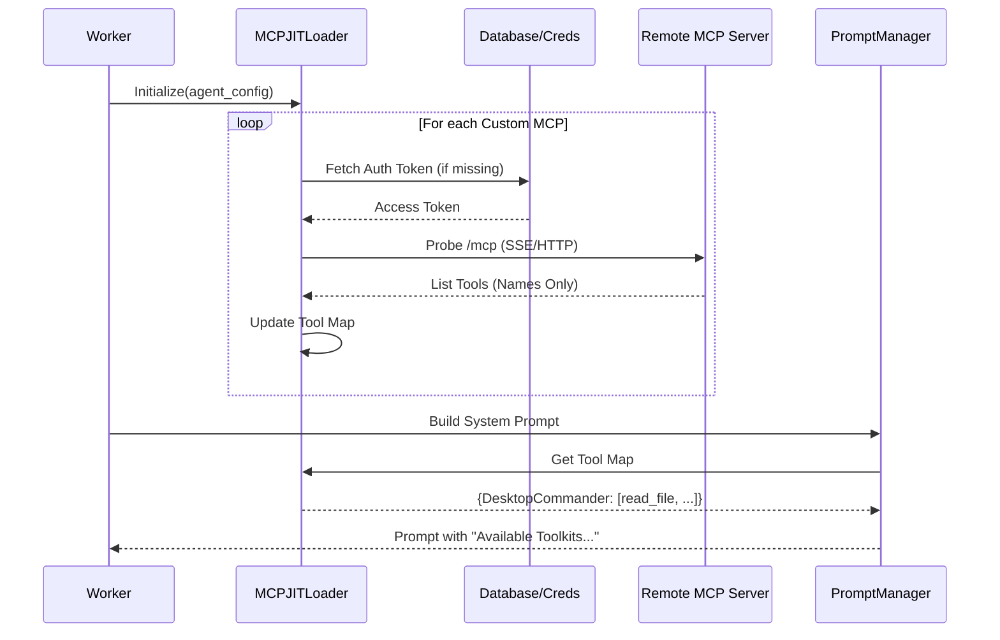
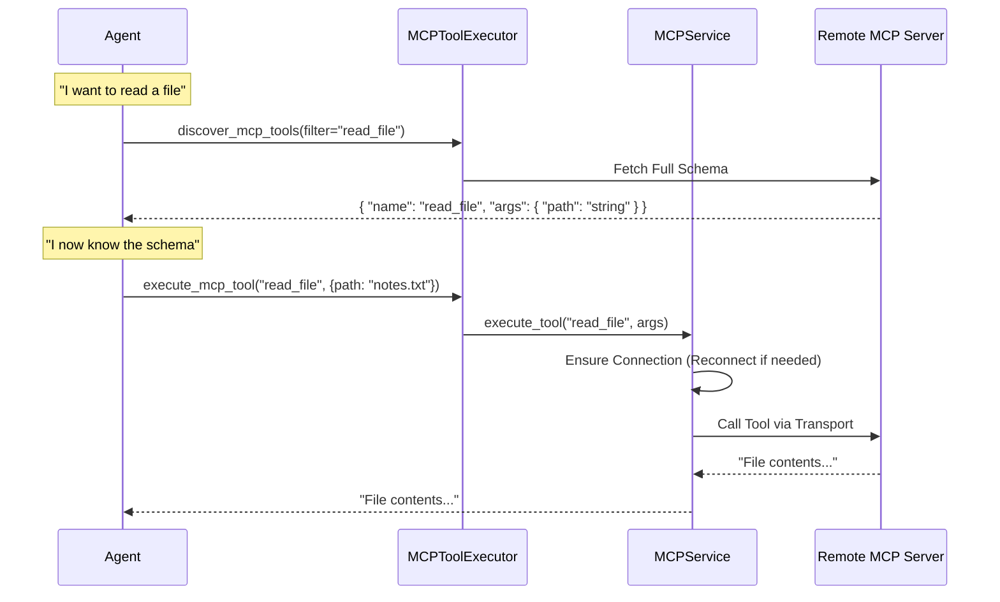

# MCP Architecture Codemap: JIT Loading & Execution

This document maps out the architecture of the Model Context Protocol (MCP) implementation in the backend, focusing on the "Just-In-Time" (JIT) loading and execution flow.

## 📝 1. File Structure (Core Files)

These are the critical files involved in the lifecycle of an MCP tool, from discovery to execution.

```text
backend/core/
├── jit/
│   ├── mcp_loader.py            # ⭐ CRITICAL: The "JIT Loader". Discovers tools, probes servers, builds the tool map.
│   └── mcp_registry.py          # Legacy/Supplementary registry logic (often used by mcp_loader).
├── run/
│   └── prompt_manager.py        # ⭐ CRITICAL: Injects tool summaries into the System Prompt.
├── mcp_module/
│   └── mcp_service.py           # ⭐ CRITICAL: The "Router" & "Executor". Manages connections and executes tools.
├── tools/
│   └── utils/
│       └── mcp_tool_executor.py # Wrapper that the Agent calls (execute_mcp_tool, discover_mcp_tools).
└── credentials/
    └── encryption_service.py    # Handles decryption of OAuth tokens for MCP servers.
```

---

## 🏗️ 2. Architecture & Data Flow

The system is designed to solve the "Context Bloat" problem. Instead of loading all tool schemas into the context window, we only load their *names* and *descriptions* (Discovery). Full schemas are loaded only when the agent asks for them (JIT).

### Phase 1: Startup & Discovery (The Loader)
*Goal: Tell the agent "These tools exist" without loading heavy JSON schemas.*

1.  **Worker Start**: `MCPJITLoader` initializes with the user's `agent_config`.
2.  **Probing (`_discover_tools_with_fallback`)**:
    *   Iterates through `custom_mcps`.
    *   **Auth Retrieval**: Fetches OAuth tokens from the database (decrypted via `EncryptionService`) if missing from config.
    *   **Ping**: Attempts to connect to the MCP server via SSE or HTTP.
3.  **Map Building**:
    *   If successful, stores `Tool Name`, `Toolkit Slug`, and `Config` in `self.tool_map`.
    *   **Crucial**: Does NOT store the full input schema yet (to save memory/time).
4.  **Prompt Injection (`PromptManager`)**:
    *   Reads `mcp_loader.tool_map`.
    *   Summarizes availability: "Desktop Commander (30 tools), Google Drive (25 tools)".
    *   Injects this summary into the Agent's System Prompt.

### Phase 2: Runtime JIT (The Agent)
*Goal: Agent wants to use a tool, so it requests the manual.*

1.  **Agent Decision**: Agent sees "Desktop Commander has `read_file`".
2.  **Discovery Call**: Agent calls `discover_mcp_tools(filter="read_file")`.
3.  **Schema Fetch**:
    *   Backend checks `mcp_loader` for `read_file`.
    *   Retrieves the **full JSON Schema** (args, types, descriptions) from the MCP server (or cache).
4.  **Context Update**: The JSON Schema is returned to the agent. The agent now knows *how* to call `read_file`.

### Phase 3: Execution (The Service)
*Goal: Run the tool.*

1.  **Execution Call**: Agent calls `execute_mcp_tool("read_file", {path: "..."})`.
2.  **Routing (`MCPService`)**:
    *   `mcp_service.execute_tool(...)` is called.
    *   Finds the correct server config for `read_file`.
3.  **Connection Management**:
    *   Checks `self._connections` (LRU Cache).
    *   If disconnected/expired, reconnects using stored credentials.
4.  **Transport**: Sends the request to the external MCP server (via `sse_client` or `http`).
5.  **Result**: Returns the output string back to the agent.

---

## 📊 3. Visual Flows (Mermaid)

### Startup & JIT Discovery


### Runtime Execution


## 🧩 4. Key Code Components

### The Prober (Loader)
*`core/jit/mcp_loader.py`*
Responsible for the initial "handshake" to verify the server is alive and get the list of tools.
```python
async def _discover_tools_with_fallback(self, config):
    # 1. Auth Injection (Patched)
    if not access_token:
        access_token = fetch_credential_from_db(...)
    
    # 2. Transport Probing
    for transport in ["sse", "http"]:
        try:
            # Pings the server
            tools = await session.list_tools() 
            return [t.name for t in tools] # Returns clean list
        except Exception:
            continue
```

### The Router (Service)
*`core/mcp_module/mcp_service.py`*
Responsible for maintaining persistent connections (LRU pattern) and routing execution.
```python
async def execute_tool(self, tool_name, args):
    # 1. Route
    connection = self._find_tool_connection(tool_name)
    
    # 2. Reconnect/Validate
    if not connection.session:
        raise MCPToolExecutionError("Session dead")

    # 3. Call
    return await connection.session.call_tool(tool_name, args)
```
