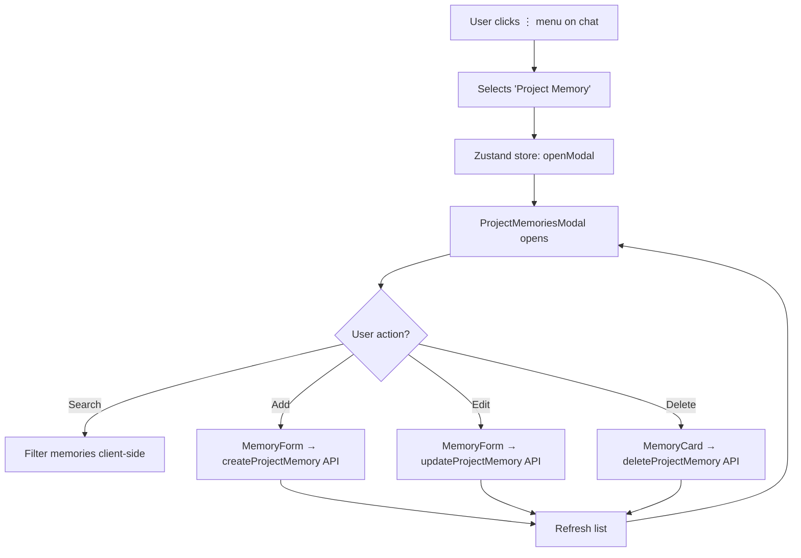
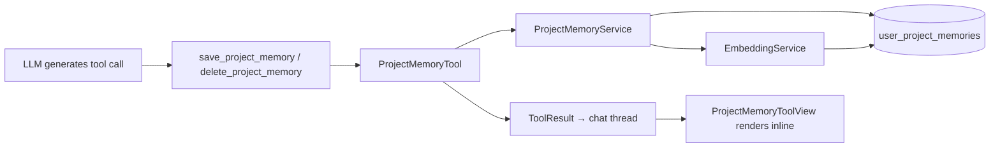
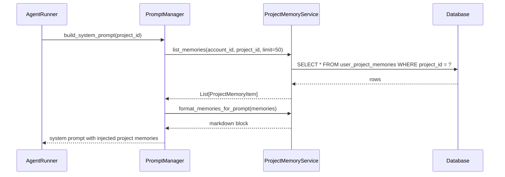

# Project Memories — Feature Codemap

> **Feature**: Project-scoped persistent memories for per-project AI context  
> **Commits**: `oxwvsqxx` (backend) + `wwwqmrsm` (frontend)  
> **Date**: 2026-02-10

---

## A. File Structure (Core Files)

| Layer | File | Purpose |
|-------|------|---------|
| DB | `backend/supabase/migrations/20260210000000_project_memories.sql` | Table, indexes, RPC functions, RLS policies |
| Model | `backend/core/memory/models.py` | `ProjectMemoryItem` dataclass + `MemoryType` enum |
| Service | `backend/core/memory/project_memory_service.py` | CRUD + semantic search + prompt formatting |
| API | `backend/core/memory/project_memory_api.py` | FastAPI REST endpoints |
| Tool | `backend/core/tools/project_memory_tool.py` | Agent tool (`save_project_memory`, `delete_project_memory`, `search_project_memories`) |
| Prompt | `backend/core/prompts/memory_consolidation_prompt.py` | Templates for Intelligence & Consolidation analysis |
| Frontend API | `frontend/src/lib/api/project-memories.ts` | Typed fetch client |
| Modal | `frontend/src/components/project-memories/ProjectMemoriesModal.tsx` | Full CRUD modal |
| Tool View | `frontend/src/components/thread/tool-views/project-memory/ProjectMemoryToolView.tsx` | Inline chat display |

---

## B. File Structure (Comprehensive)

```text
backend/
├── api.py                                                    # Router registration (MODIFIED)
│   └── Added: project memory router mounted at /api/projects/{project_id}/memories
├── core/
│   ├── memory/
│   │   ├── models.py                                         # Data models (MODIFIED) ⭐ CRITICAL
│   │   │   ├── MemoryType(Enum)           — fact | preference | context | conversation_summary
│   │   │   ├── MemoryItem(@dataclass)     — existing global memory model
│   │   │   └── ProjectMemoryItem(@dataclass)  — NEW: project-scoped memory model
│   │   ├── project_memory_service.py                         # Business logic (ADDED) ⭐ CRITICAL
│   │   │   └── ProjectMemoryService
│   │   │       ├── create_memory()        — insert + embedding generation
│   │   │       ├── get_memory()           — single fetch by ID
│   │   │       ├── list_memories()        — paginated list with optional type filter
│   │   │       ├── update_memory()        — partial update + re-embedding
│   │   │       ├── delete_memory()        — soft delete by ID
│   │   │       ├── delete_all_memories()  — bulk purge
│   │   │       ├── search_memories()      — vector cosine similarity search via RPC
│   │   │       ├── get_stats()            — aggregate counts by type
│   │   │       ├── format_memories_for_prompt() — markdown formatter for system prompt injection
│   │   │       └── _invalidate_cache(), _row_to_item(), _item_to_dict(), _dict_to_item()
│   │   └── project_memory_api.py                             # REST API (ADDED) ⭐ CRITICAL
│   │       ├── Pydantic models: ProjectMemoryResponse, CreateRequest, UpdateRequest, StatsResponse
│   │       ├── _verify_project_ownership() — account membership check
│   │       ├── GET    /                   — list_project_memories (paginated)
│   │       ├── POST   /                   — create_project_memory
│   │       ├── GET    /stats              — get_project_memory_stats
│   │       ├── GET    /{memory_id}        — get_project_memory
│   │       ├── PUT    /{memory_id}        — update_project_memory
│   │       ├── DELETE /{memory_id}        — delete_project_memory
│   │       └── DELETE /                   — delete_all_project_memories (requires ?confirm=true)
│   ├── prompts/
│   │   ├── memory_consolidation_prompt.py                    # Analysis templates (ADDED) ⭐ NEW
|   |   |   ├── MEMORY_CONSOLIDATION_SYSTEM_PROMPT
|   |   |   └── MEMORY_KEYWORD_EXTRACTION_SYSTEM_PROMPT
│   │   ├── core_prompt.py                                    # Proactive instructions (MODIFIED)
│   ├── run/
│   │   ├── agent_runner.py                                   # Agent loop (MODIFIED)
│   │   │   └── Passes project_id to build_system_prompt() at both call sites
│   │   ├── prompt_manager.py                                 # System prompt builder (MODIFIED) ⭐ CRITICAL
│   │   │   └── build_system_prompt() — accepts project_id, calls _fetch_project_memories()
│   │   └── tool_manager.py                                   # Tool registration (MODIFIED)
│   │       └── _register_core_tools() — registers ProjectMemoryTool with account_id guard
│   └── tools/
│       ├── project_memory_tool.py                            # Agent tool (MODIFIED) ⭐ CRITICAL
│       │   └── ProjectMemoryTool(SandboxToolsBase)
│       │       ├── save_project_memory(content, memory_type) — TRIGGERS CONSOLIDATION
│       │       ├── delete_project_memory(memory_id)
│       │       └── search_project_memories(query)             — NEW: Explicit search
│       ├── tool_registry.py                                  # (MODIFIED) — added to CORE_TOOLS
│       └── tool_guide_registry.py                            # (MODIFIED) — added to category_map
│   ├── jit/
│   │   └── loader.py                                         # (MODIFIED) — added to core JIT tools
├── supabase/
│   └── migrations/
│       └── 20260210000000_project_memories.sql               # DB schema (ADDED) ⭐ CRITICAL
│           ├── TABLE: user_project_memories (UUID PK, account_id, project_id, content, type, embedding)
│           ├── INDEXES: account_id, project_id, type, created_at, source_thread, ivfflat vector
│           ├── RPC: search_project_memories_by_similarity()
│           ├── RPC: get_project_memory_stats()
│           ├── RLS: 4 policies (select/insert/update/delete) + service_role full access
│           └── GRANTS: authenticated + service_role

frontend/src/
├── lib/
│   └── api/
│       └── project-memories.ts                               # API client (ADDED) ⭐ CRITICAL
│           ├── Types: MemoryType, ProjectMemory, CreatePayload, UpdatePayload, ListResponse
│           ├── listProjectMemories(projectId, opts)
│           ├── getProjectMemory(projectId, memoryId)
│           ├── createProjectMemory(projectId, payload)
│           ├── updateProjectMemory(projectId, memoryId, payload)
│           ├── deleteProjectMemory(projectId, memoryId)
│           └── searchProjectMemories(projectId, query, opts)
├── stores/
│   └── use-project-memories-modal-store.ts                   # Zustand store (ADDED)
│       └── { isOpen, projectId, projectName, openModal(), closeModal() }
├── components/
│   ├── project-memories/
│   │   └── ProjectMemoriesModal.tsx                          # CRUD modal (ADDED) ⭐ CRITICAL
│   │       ├── MemoryCard — animated card with edit/delete actions
│   │       ├── MemoryForm — inline add/edit form with type selector
│   │       └── ProjectMemoriesModal — main modal with search, filter, grouped list
│   ├── sidebar/
│   │   └── nav-agents.tsx                                    # Sidebar integration (MODIFIED)
│   │       ├── Added Brain icon import
│   │       ├── Added "Project Memory" DropdownMenuItem in SingleChatCard
│   │       └── Renders <ProjectMemoriesModal /> globally
│   └── thread/
│       └── tool-views/
│           ├── project-memory/                               # Tool view feature dir (ADDED)
│           │   ├── _utils.ts                                 # Data extraction utilities
│           │   │   ├── ProjectMemoryActionResult interface
│           │   │   ├── extractProjectMemoryData()
│           │   │   └── getMemoryActionType()
│           │   └── ProjectMemoryToolView.tsx                  # Chat tool view (ADDED) ⭐ CRITICAL
│           │       ├── MemoryTypeBadge — color-coded type badge
│           │       └── ProjectMemoryToolView — card with header, content, footer
│           ├── utils.ts                                      # (MODIFIED) — added tool title mappings
│           └── wrapper/
│               └── ToolViewRegistry.tsx                      # (MODIFIED) — registered 4 tool name variants

conductor/tracks/project_memories_20260210/
├── plan.md                                                   # Implementation plan (MODIFIED)
├── Agentic_Outline_Phase1.md                                 # Phase 1 agent outline (ADDED)
├── Agentic_Outline_Frontend.md                               # Frontend agent outline (ADDED)
└── agent_zero_memory_architecture.md                         # Architecture reference (ADDED)
```

---

## C. Architecture & Data Flow

### Component Interaction Flow

The feature spans four logical tiers:

1. **Database** → `user_project_memories` table with vector embeddings for semantic search
2. **Service Layer** → `ProjectMemoryService` handles all CRUD, embedding generation, caching, and prompt formatting
3. **Dual Entry Points**:
   - **REST API** (`project_memory_api.py`) → User-initiated CRUD via the modal UI
   - **Agent Tool** (`project_memory_tool.py`) → AI-initiated save/delete during conversations
4. **Prompt Injection** → `PromptManager.build_system_prompt()` fetches project memories and injects them into the system prompt

### Data Flow

```
┌─────────────────────────────────────────────────────────────────────┐
│                         FRONTEND                                    │
│                                                                     │
│  Sidebar (nav-agents.tsx)                                          │
│    └── "Project Memory" menu item                                  │
│          └── Opens Zustand store → ProjectMemoriesModal             │
│                ├── List, Search, Filter                             │
│                ├── Add/Edit via MemoryForm                         │
│                └── Delete via MemoryCard                           │
│                      │                                              │
│                      ▼                                              │
│  API Client (project-memories.ts)                                  │
│    └── fetch() with Bearer JWT → Backend REST API                  │
│                                                                     │
│  Tool Views (ProjectMemoryToolView.tsx)                            │
│    └── Renders save/delete results inline in chat thread           │
│          └── Data extracted via _utils.ts                          │
└────────────────────────┬────────────────────────────────────────────┘
                         │ HTTP
                         ▼
┌─────────────────────────────────────────────────────────────────────┐
│                         BACKEND                                     │
│                                                                     │
│  FastAPI Router (project_memory_api.py)                            │
│    └── /api/projects/{project_id}/memories/*                       │
│          └── _verify_project_ownership() → account membership check │
│                │                                                    │
│                ▼                                                    │
│  ProjectMemoryService (project_memory_service.py)                  │
│    ├── create_memory()  → EmbeddingService.get_embedding()         │
│    ├── update_memory()  → re-embed if content changed              │
│    ├── search_memories()→ RPC: search_project_memories_by_similarity│
│    └── format_memories_for_prompt() → markdown block               │
│                │                                                    │
│                ▼                                                    │
│  Agent Tool (project_memory_tool.py)                               │
│    └── save_project_memory() / delete_project_memory()             │
│          └── Called by LLM tool calls during agent loop            │
│                                                                     │
│  Prompt Manager (prompt_manager.py)                                │
│    └── build_system_prompt(project_id=...)                         │
│          └── _fetch_project_memories() → injects into prompt       │
│                                                                     │
│  Agent Runner (agent_runner.py)                                    │
│    └── Passes project_id to PromptManager at both call sites       │
└────────────────────────┬────────────────────────────────────────────┘
                         │ SQL
                         ▼
┌─────────────────────────────────────────────────────────────────────┐
│                         DATABASE                                    │
│                                                                     │
│  user_project_memories                                             │
│    ├── PK: memory_id (UUID)                                        │
│    ├── FK: account_id → basejump.accounts(id)                      │
│    ├── FK: project_id → projects(project_id)                       │
│    ├── FK: source_thread_id → threads(thread_id) [nullable]        │
│    ├── content (TEXT) + memory_type (ENUM) + metadata (JSONB)      │
│    ├── embedding vector(1536) — ivfflat cosine index               │
│    └── RLS: owner-only policies + service_role bypass              │
│                                                                     │
│  RPC Functions:                                                    │
│    ├── search_project_memories_by_similarity()                     │
│    └── get_project_memory_stats()                                  │
└─────────────────────────────────────────────────────────────────────┘
```

### Mermaid: User Interaction Flow



### Mermaid: Agent Tool Flow



### Mermaid: Prompt Injection Flow



---

## D. Code Examples

### ⭐ ProjectMemoryItem Dataclass (`models.py`)

```python
@dataclass
class ProjectMemoryItem:
    """A memory scoped to a specific project, for per-project AI context."""
    memory_id: str
    account_id: str
    project_id: str
    content: str
    memory_type: MemoryType
    embedding: Optional[List[float]] = None
    source_thread_id: Optional[str] = None
    confidence_score: float = 1.0
    metadata: Dict[str, Any] = None
    created_at: Optional[datetime] = None
    updated_at: Optional[datetime] = None
```

### ⭐ Agent Tool — save_project_memory (`project_memory_tool.py`)

```python
async def save_project_memory(self, content: str, memory_type: str = "fact") -> ToolResult:
    if not content or not content.strip():
        return self.fail_response("Memory content cannot be empty")

    valid_types = {"fact", "preference", "context", "conversation_summary"}
    if memory_type not in valid_types:
        memory_type = "fact"

    from core.memory.project_memory_service import project_memory_service
    memory = await project_memory_service.create_memory(
        account_id=self.account_id,
        project_id=self.project_id,
        content=content.strip(),
        memory_type=memory_type,
        confidence_score=1.0,
        source_thread_id=self.thread_id,
    )
    return self.success_response(
        f"✅ Project memory saved (id: {memory.memory_id}, type: {memory.memory_type.value})"
    )
```

### ⭐ Frontend API Client — listProjectMemories (`project-memories.ts`)

```typescript
export async function listProjectMemories(
    projectId: string,
    opts?: { page?: number; pageSize?: number; memoryType?: MemoryType }
): Promise<ProjectMemoriesListResponse> {
    const headers = await getAuthHeaders();
    const params = new URLSearchParams();
    if (opts?.page) params.set('page', String(opts.page));
    if (opts?.pageSize) params.set('page_size', String(opts.pageSize));
    if (opts?.memoryType) params.set('memory_type', opts.memoryType);

    const url = `${getBackendUrl()}/api/projects/${projectId}/memories?${params}`;
    const res = await fetch(url, { headers });
    if (!res.ok) throw new Error(`Failed to list memories: ${res.statusText}`);
    return res.json();
}
```

### ⭐ Tool View Data Extraction (`_utils.ts`)

```typescript
export function extractProjectMemoryData(
    argumentsData?: Record<string, unknown>,
    outputData?: unknown
): ProjectMemoryActionResult | null {
    // Try output first (from toolResult.output)
    if (outputData) {
        if (typeof outputData === 'object' && outputData !== null) {
            const out = outputData as Record<string, unknown>;
            if (out.memory_id || out.content || out.message) {
                return out as ProjectMemoryActionResult;
            }
        }
        if (typeof outputData === 'string') {
            return { message: outputData, success: true };
        }
    }
    // Fallback to arguments
    if (argumentsData && typeof argumentsData === 'object') {
        return {
            content: argumentsData.content as string | undefined,
            memory_type: argumentsData.memory_type as string | undefined,
            memory_id: argumentsData.memory_id as string | undefined,
        };
    }
    return null;
}
```

---

## E. Database Schema

### Table: `user_project_memories`

| Column | Type | Constraints |
|--------|------|-------------|
| `memory_id` | `UUID` | PK, default `gen_random_uuid()` |
| `account_id` | `UUID` | FK → `basejump.accounts(id)` ON DELETE CASCADE |
| `project_id` | `UUID` | FK → `projects(project_id)` ON DELETE CASCADE |
| `content` | `TEXT` | NOT NULL |
| `memory_type` | `memory_type` (enum) | NOT NULL, default `'fact'` |
| `embedding` | `vector(1536)` | nullable, ivfflat cosine index |
| `source_thread_id` | `UUID` | nullable FK → `threads(thread_id)` ON DELETE SET NULL |
| `confidence_score` | `FLOAT` | default `1.0` |
| `metadata` | `JSONB` | default `'{}'` |
| `created_at` | `TIMESTAMPTZ` | NOT NULL, default `NOW()` |
| `updated_at` | `TIMESTAMPTZ` | NOT NULL, auto-updated via trigger |

### Indexes

| Index | Columns | Type |
|-------|---------|------|
| `idx_project_memories_account_id` | `account_id` | btree |
| `idx_project_memories_project_id` | `project_id` | btree |
| `idx_project_memories_memory_type` | `memory_type` | btree |
| `idx_project_memories_created_at` | `created_at DESC` | btree |
| `idx_project_memories_source_thread` | `source_thread_id` (partial) | btree |
| `idx_project_memories_embedding_vector` | `embedding` | ivfflat (lists=100) |

### RLS Policies

All four CRUD policies check account ownership via `basejump.accounts.primary_owner_user_id` OR `basejump.account_user` membership. Service role has unrestricted access.

---

## F. API Endpoints

Base path: `/api/projects/{project_id}/memories`

| Method | Path | Handler | Description |
|--------|------|---------|-------------|
| GET | `/` | `list_project_memories` | Paginated list (query: `page`, `limit`, `memory_type`) |
| POST | `/` | `create_project_memory` | Create memory (body: `content`, `memory_type`, `metadata`) |
| GET | `/stats` | `get_project_memory_stats` | Aggregate stats by type |
| GET | `/{memory_id}` | `get_project_memory` | Single memory by ID |
| PUT | `/{memory_id}` | `update_project_memory` | Partial update |
| DELETE | `/{memory_id}` | `delete_project_memory` | Delete single memory |
| DELETE | `/` | `delete_all_project_memories` | Bulk delete (requires `?confirm=true`) |

All endpoints require JWT authentication via `verify_and_get_user_id_from_jwt` dependency.

---

## G. State Management

### Zustand Store (`use-project-memories-modal-store.ts`)

```typescript
interface ProjectMemoriesModalState {
    isOpen: boolean;
    projectId: string | null;
    projectName: string | null;
    openModal: (projectId: string, projectName?: string) => void;
    closeModal: () => void;
}
```

Triggered from `SingleChatCard` dropdown menu in `nav-agents.tsx`. The modal itself (`ProjectMemoriesModal`) reads from this store and manages its own local state for memories list, search, filter, form visibility, and loading states.

---

## H. Tool View Registration

In `ToolViewRegistry.tsx`, the `ProjectMemoryToolView` is registered for four tool name variants to handle both hyphenated and underscored naming:

```typescript
'save-project-memory': ProjectMemoryToolView,
'delete-project-memory': ProjectMemoryToolView,
'save_project_memory': ProjectMemoryToolView,
'delete_project_memory': ProjectMemoryToolView,
```

Tool title mappings in `utils.ts`:
- `save-project-memory` → `"Save Project Memory"`
- `delete-project-memory` → `"Delete Project Memory"`

---

## I. Key Design Decisions

1. **Separate table from global memories** — `user_project_memories` vs `user_memories` to keep project-scoped data isolated with independent RLS.
2. **Vector embeddings at write time** — Embeddings are generated on create/update, not on read, enabling fast semantic search via the `search_project_memories_by_similarity` RPC.
3. **Dual entry points** — Both manual UI (modal) and autonomous agent (tool) can create/delete memories, converging on the same `ProjectMemoryService`.
4. **Prompt injection** — Memories are formatted as markdown and injected into the system prompt by `PromptManager`, ensuring the agent always has project context.
5. **Tool name normalization** — Registry handles both `save_project_memory` (as sent by the LLM) and `save-project-memory` (as normalized by the pipeline).
6. **Premium modal UX** — Glassmorphism, framer-motion animations, grouped-by-type display, inline forms, and optimistic deletion.

---

## J. Intelligence & Consolidation (Phase 6)

To prevent memory bloat and ensure high-quality retrieval, we are implementing an **Intelligence & Consolidation Pipeline** inspired by Agent-Zero.

### 1. Augmented Retrieval (Keyword Extraction)
When an agent searches for memories (or when the system injects them), the service will use an LLM to extract 2-4 search keywords. This improves recall over raw semantic search by focusing on high-signal terms (technologies, specific entities, action verbs).

### 2. The Consolidation Analyst
When `save_project_memory` is called, the system no longer does a blind insert. Instead:
1. **Search**: Find similar memories (threshold ~0.7).
2. **Analyze**: Call the `Consolidation Analyst` (LLM) with the new fact + existing facts.
3. **Execute**: The LLM decides on one of four actions:
   - `merge`: Combine new and old into one comprehensive entry.
   - `replace`: Delete outdated entry, insert new one.
   - `update`: Add details to an existing entry.
   - `keep_separate`: If the information is distinct.

### 3. Explicit Search Tool
Agents now have `search_project_memories`. This allows them to proactively "look up" facts during deep research tasks rather than relying purely on the initial context injection.
