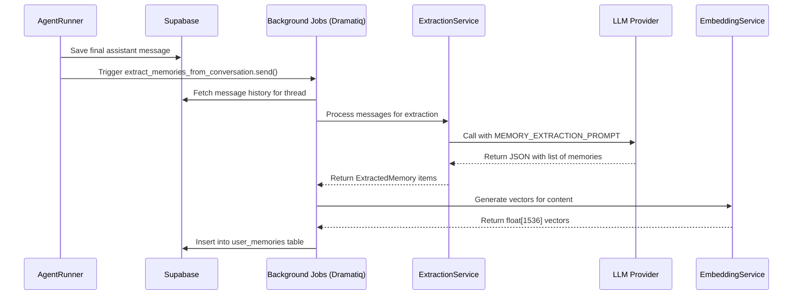
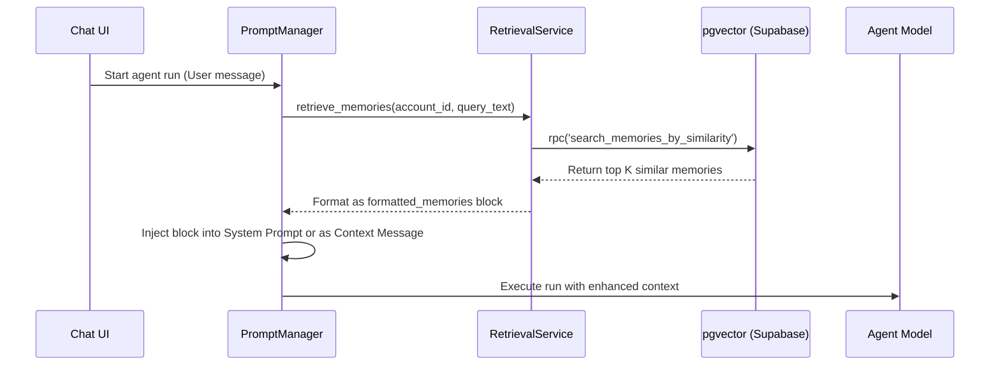

# Memories Feature Codemap

The **Memories** system is a sophisticated long-term recall mechanism that allows Suna Kortix agents to remember user facts, preferences, and project context across multiple conversation threads. It uses vector embeddings and semantic search to provide relevant context injection during agent runs.

## A. File Structure (Core Files)

- `backend/core/memory/models.py`: ⭐ CRITICAL Core data structures and Enums.
- `backend/core/memory/extraction_service.py`: ⭐ CRITICAL Logic for distilling conversations into memories via LLM.
- `backend/core/memory/retrieval_service.py`: ⭐ CRITICAL Semantic search and prompt-injection formatting logic.
- `backend/core/memory/embedding_service.py`: Interface for generating vector embeddings.
- `backend/core/memory/background_jobs.py`: Dramatiq actors for async extraction and consolidation.
- `backend/core/memory/api.py`: FastAPI endpoints for memory management.
- `backend/core/prompts/memory_extraction_prompt.py`: The system prompt used for LLM extraction.
- `frontend/src/lib/api/memory.ts`: Frontend REST client for memory services.
- `frontend/src/hooks/memory/use-memory.ts`: React Query hooks for memory state management.
- `frontend/src/components/thread/chat-input/memory-toggle.tsx`: UI component to enable/disable memory.

## B. File Structure (Comprehensive)

```text
root/
├── backend/
│   ├── core/
│   │   ├── memory/
│   │   │   ├── __init__.py
│   │   │   ├── api.py                   # FastAPI Router /memory/*
│   │   │   ├── background_jobs.py       # Async workers (extraction, embedding, consolidation) ⭐ CRITICAL
│   │   │   ├── embedding_service.py     # OpenAI vector generation wrapper
│   │   │   ├── extraction_service.py   # LLM interaction for memory creation ⭐ CRITICAL
│   │   │   ├── models.py                # Pydantic/Dataclass models (FACT, PREFERENCE, etc.) ⭐ CRITICAL
│   │   │   └── retrieval_service.py     # Similarity search and prompt formatting ⭐ CRITICAL
│   │   ├── prompts/
│   │   │   └── memory_extraction_prompt.py # Specialized prompt for memory distillation
│   │   └── run/
│   │       └── prompt_manager.py        # Injects memories into Agent system prompt ⭐ CRITICAL
│   └── run_agent_background.py          # Entry point that triggers extraction at end of run
└── frontend/src/
    ├── components/
    │   ├── memory/
    │   │   ├── MemoryCard.tsx           # Individual memory UI
    │   │   ├── MemoryList.tsx           # Main settings list for memories
    │   │   └── MemorySettings.tsx       # Global memory toggle settings
    │   └── thread/chat-input/
    │       └── memory-toggle.tsx        # "Brain" icon in chat input ⭐ CRITICAL
    ├── hooks/memory/
    │   └── use-memory.ts                # React hooks for fetching/mutating memories
    └── lib/api/
        └── memory.ts                    # Backend API client bindings
```

## C. Architecture & Data Flow

### 1. Memory Lifecycle (Extraction)
The extraction process begins when a conversation thread concludes.



### 2. Contextual Retrieval (Recall)
When a new run starts, the system retrieves relevant past knowledge.



## D. Code Examples

### Memory Extraction Logic (`extraction_service.py`)
This snippet illustrates how the LLM is used to distill a conversation into structured facts.

```python
async def extract_memories(self, messages: List[Dict[str, Any]], account_id: str, thread_id: str) -> List[ExtractedMemory]:
    # Formats the messages into a text blob for the LLM
    conversation_text = self._format_conversation(messages)
    
    # Calls the dedicated extraction model
    response = await model_manager.generate(
        model=self.model,
        messages=[{"role": "user", "content": MEMORY_EXTRACTION_PROMPT.format(conversation=conversation_text)}],
        response_format={"type": "json_object"}
    )
    
    # Parses valid memories into objects
    data = json.loads(response.content)
    if not data.get("worth_extracting"):
        return []
        
    return [ExtractedMemory(**m) for m in data.get("memories", [])]
```

### Retrieval & Injection (`retrieval_service.py`)
This snippet shows how memories are formatted to be easily consumed by the AI agent.

```python
def format_memories_for_prompt(self, memories: List[MemoryItem]) -> str:
    if not memories:
        return ""
        
    parts = ["### RELEVANT USER MEMORIES"]
    for mem in memories:
        timestamp = mem.created_at.strftime("%Y-%m-%d")
        parts.append(f"- [{mem.memory_type.value}] ({timestamp}): {mem.content}")
        
    return "\n".join(parts)
```

## E. Database Schema & Infrastructure

### 1. `user_memories` Table
- `memory_id`: UUID (Primary Key)
- `account_id`: UUID (Foreign Key to users)
- `content`: Text (The literal fact)
- `embedding`: `vector(1536)` (The semantic vector for inner-product search)
- `memory_type`: Enum (`fact`, `preference`, `context`, `conversation_summary`)
- `confidence_score`: Float (0.0 to 1.0)
- `source_thread_id`: UUID (Reference to where the memory originated)

### 2. Constraints & Tiering
The memory system is strictly governed by user subscription tiers:
- **Free Tier**: 500 memories max, 5 memories per retrieval.
- **Pro Tier**: 5,000 memories max, 20 memories per retrieval.
- **Enterprise**: 50,000 memories max, 50 memories per retrieval.

Limits are defined and enforced in `backend/core/billing/shared/config.py`.

### 3. Cleanup & Consolidation
A periodic background job (`consolidate_memories`) runs to:
- Identify memories with cosine similarity > 0.95.
- Merge or delete near-duplicates.
- Prioritize high-confidence memories when limits are reached.
