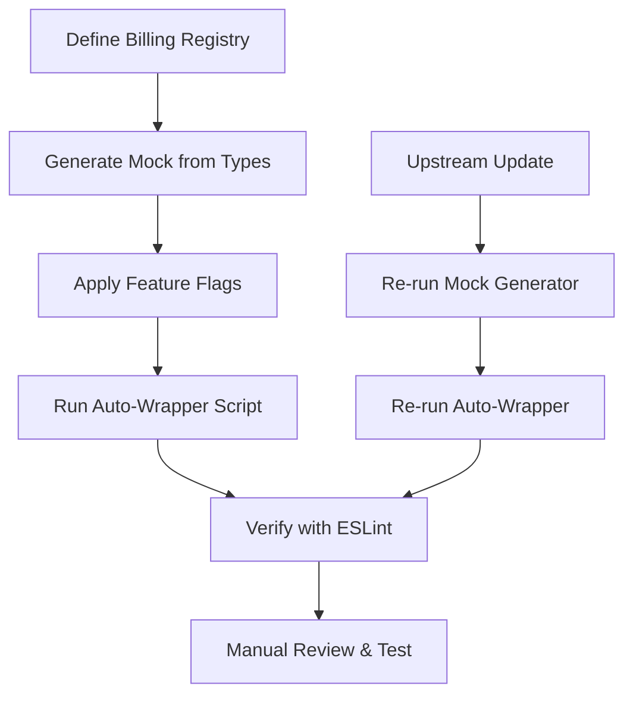

# Example: Programmatic Feature Disablement - Billing System

A case study demonstrating how to disable a deeply integrated feature (billing/credits) across a Next.js codebase with minimal code changes and maximum upstream compatibility.

---

## Overview

**Target Feature:** Billing and credit tracking system in Suna (Next.js 16 + FastAPI)

**Integration Depth:**
- 50+ files with billing references
- 9 hooks, 14 components, 300-line API layer
- Middleware guards, Zustand store, multiple routes
- Deep UI integration (sidebar, settings, modals)

**Goal:** Disable entirely while maintaining upgrade compatibility

---

## Implemented Strategy: 5-Layer Conditional Architecture

### Layer 1: Feature Flag Foundation (✅ Zero Edits)

**Files Created:**
- `src/lib/config/features.ts` (NEW - 20 lines)
- `.env.whitelabel` (NEW - 10 lines)

```typescript
// src/lib/config/features.ts
export const FEATURES = {
  BILLING_ENABLED: process.env.NEXT_PUBLIC_DISABLE_BILLING !== 'true',
  UNLIMITED_MODE: process.env.NEXT_PUBLIC_UNLIMITED_MODE === 'true',
} as const;
```

**Activation:**
```bash
# .env.local
NEXT_PUBLIC_DISABLE_BILLING=true
NEXT_PUBLIC_UNLIMITED_MODE=true
```

**Assessment:**
- ✅ Instant on/off switch
- ✅ No code changes
- ✅ Perfect for upstream compatibility
- ⚠️ Requires discipline to use consistently

---

### Layer 2: API Mocking Layer (🟢 1 Edit)

**Files Created:**
- `src/lib/api/billing-mock.ts` (NEW - 200 lines)

**Files Modified:**
- `src/lib/api/billing.ts` (+3 lines)

```typescript
// billing.ts - ONLY CHANGE
import { FEATURES } from '@/lib/config/features';
import { mockBillingApi } from './billing-mock';

// ... existing code ...

export const billingApi = FEATURES.BILLING_ENABLED 
  ? actualBillingApi 
  : mockBillingApi;
```

**Mock Returns:**
```typescript
const MOCK_UNLIMITED_STATE = {
  credits: { total: 999999999 },
  subscription: { tier_key: 'unlimited', status: 'active' },
  // ... unlimited everything
};
```

**Assessment:**
- ✅ Centralizes all API behavior
- ✅ Single 3-line conditional export
- ✅ Survives upstream billing.ts changes (export rarely changes)
- ⚠️ Must keep mock in sync with API interface changes
- ⚠️ Doesn't hide UI (needs Layer 3)

---

### Layer 3: Component Wrapper Pattern (✅ Zero Edits)

**Files Created:**
- `src/components/whitelabel/billing-wrapper.tsx` (NEW - 30 lines)

```typescript
export function BillingGate({ children }: { children: ReactNode }) {
  if (!FEATURES.BILLING_ENABLED) return null;
  return <>{children}</>;
}

export function CreditDisplay({ children }: { children: ReactNode }) {
  if (FEATURES.UNLIMITED_MODE) {
    return <div className="text-green-600">Unlimited</div>;
  }
  return <>{children}</>;
}
```

**Usage:**
```tsx
// Anywhere billing UI exists
<BillingGate>
  <SubscriptionCard />
  <CreditPurchase />
</BillingGate>
```

**Assessment:**
- ✅ No modifications to original components
- ✅ Reusable pattern
- ❌ Requires manual wrapping in each file
- ⚠️ 10-20 files need wrapper additions

---

### Layer 4: Navigation Hiding (🟡 Medium Edits)

**Files Modified:**
- `src/components/sidebar/sidebar-content.tsx` (~5 lines)
- `src/app/(dashboard)/settings/page.tsx` (~3 lines per tab)

```diff
+import { FEATURES } from '@/lib/config/features';

 <nav>
   <NavItem href="/agents">Agents</NavItem>
+  {FEATURES.BILLING_ENABLED && (
     <NavItem href="/subscription">Subscription</NavItem>
+  )}
 </nav>
```

**Assessment:**
- ⚠️ 5-10 files need conditional rendering
- ⚠️ Merge conflicts likely on navigation changes
- ✅ Simple pattern, easy to apply

---

### Layer 5: Middleware & Route Guards (🟡 Medium Edits)

**Files Modified:**
- `src/middleware.ts` (~15 lines)

```diff
+import { FEATURES } from '@/lib/config/features';

 export async function middleware(request: NextRequest) {
+  // Disable billing entirely
+  if (!FEATURES.BILLING_ENABLED) {
+    // Redirect billing pages
+    if (['/subscription', '/checkout'].includes(path)) {
+      return NextResponse.redirect(new URL('/dashboard', request.url));
+    }
+    return NextResponse.next(); // Skip all billing checks
+  }
   
   // Original billing checks...
 }
```

**Assessment:**
- ⚠️ Core middleware modification
- ⚠️ High conflict risk on auth/routing changes
- ✅ Powerful - bypasses all guards at once

---

## Implementation Statistics

| Metric | Count |
|--------|-------|
| **New Files Created** | 3 |
| **Files Modified** | 12-15 |
| **Lines Added** | ~300 (mostly new files) |
| **Lines Modified** | ~30 (in existing files) |
| **Merge Conflict Risk** | Medium (15% of files) |

---

## Critical Analysis

### Strengths ✅

1. **Single Toggle Point**
   - One env var controls everything
   - Instant rollback capability
   - Easy to test both modes

2. **Minimal Core Modifications**
   - Only 1 line in main API file (`billing.ts`)
   - Most changes are additive (new files)
   - Original components untouched

3. **Upstream Compatibility**
   - New mock file won't conflict with upstream
   - Feature flag can be applied to new code
   - API export pattern stable

### Weaknesses ⚠️

1. **Manual Application Required**
   - Each billing component needs manual wrapping
   - Navigation changes need manual conditionals
   - Not truly "programmatic"

2. **Maintenance Burden**
   - Mock must stay in sync with API interface
   - New billing features require mock updates
   - Wrapper additions in 10-20 files

3. **Incomplete Coverage**
   - UI still renders then hides (performance)
   - Some edge cases may show billing UI
   - Requires comprehensive testing

4. **Not Automated**
   - Can't handle upstream billing additions automatically
   - New billing endpoints need manual mock additions
   - New UI components need manual wrapping

---

## Alternative Approaches: Critique & Comparison

### Alternative 1: Babel/Webpack Plugin (Advanced)

**Concept:** Dead code elimination at build time

```javascript
// babel-plugin-strip-billing.js
module.exports = function({ types: t }) {
  return {
    visitor: {
      ImportDeclaration(path) {
        // Remove all imports from '@/lib/api/billing'
        if (path.node.source.value.includes('/billing')) {
          path.remove();
        }
      },
      JSXElement(path) {
        // Remove all billing components
        const name = path.node.openingElement.name.name;
        if (billingComponents.includes(name)) {
          path.remove();
        }
      }
    }
  };
};
```

**Pros:**
- ✅ Truly programmatic
- ✅ Zero runtime overhead
- ✅ Automatically handles new billing code
- ✅ Smaller bundle size

**Cons:**
- ❌ Complex tooling setup
- ❌ Hard to debug
- ❌ May break TypeScript
- ❌ Requires comprehensive billing component list

**Verdict:** Too complex for benefit, harder to maintain

---

### Alternative 2: Proxy Pattern (Runtime)

**Concept:** Intercept all billing API calls at runtime

```typescript
// src/lib/api-interceptor.ts
const originalFetch = window.fetch;
window.fetch = function(...args) {
  const [url] = args;
  
  // Block all billing endpoints
  if (typeof url === 'string' && url.includes('/billing/')) {
    return Promise.resolve(new Response(
      JSON.stringify(MOCK_UNLIMITED_STATE),
      { status: 200 }
    ));
  }
  
  return originalFetch.apply(this, args);
};
```

**Pros:**
- ✅ Truly zero code changes
- ✅ Catches all billing calls
- ✅ Works with new endpoints automatically

**Cons:**
- ❌ Doesn't hide UI
- ❌ Still renders billing components (performance)
- ❌ Global fetch override is fragile
- ❌ Hard to debug
- ❌ May interfere with other code

**Verdict:** Too hacky, doesn't solve UI hiding

---

### Alternative 3: Module Aliasing (Webpack)

**Concept:** Redirect all billing imports to mocks

```javascript
// next.config.js
module.exports = {
  webpack: (config) => {
    if (process.env.NEXT_PUBLIC_DISABLE_BILLING === 'true') {
      config.resolve.alias = {
        ...config.resolve.alias,
        '@/lib/api/billing': '@/lib/api/billing-mock',
        '@/hooks/billing': '@/hooks/billing-mock',
        '@/components/billing': '@/components/billing-mock',
      };
    }
    return config;
  },
};
```

**Pros:**
- ✅ Completely transparent
- ✅ No import changes needed
- ✅ Automatic for all billing modules

**Cons:**
- ❌ Requires creating mock versions of EVERYTHING
- ❌ Huge duplication (14 components × mock versions)
- ❌ Hard to keep mocks in sync
- ❌ Doesn't handle inline billing logic

**Verdict:** Too much duplication, maintenance nightmare

---

### Alternative 4: AST Transformation (Code Generation)

**Concept:** Use jscodeshift to auto-wrap everything

```javascript
// scripts/wrap-billing.js
const j = require('jscodeshift');

module.exports = function(fileInfo, api) {
  const root = j(fileInfo.source);
  
  // Find all JSX elements from billing components
  root.find(j.JSXElement).forEach(path => {
    const name = path.node.openingElement.name.name;
    if (billingComponents.includes(name)) {
      // Wrap with <BillingGate>
      path.replaceWith(
        j.jsxElement(
          j.jsxOpeningElement(j.jsxIdentifier('BillingGate')),
          j.jsxClosingElement(j.jsxIdentifier('BillingGate')),
          [path.node]
        )
      );
    }
  });
  
  return root.toSource();
};
```

**Run:** `npx jscodeshift -t wrap-billing.js src/`

**Pros:**
- ✅ Automated wrapping
- ✅ Can handle entire codebase
- ✅ Repeatable for upstream changes

**Cons:**
- ❌ Modifies source files directly
- ❌ Merge conflicts on modified files
- ❌ Hard to update after upstream sync
- ❌ May wrap incorrectly in complex cases

**Verdict:** Good for initial application, bad for maintenance

---

### Alternative 5: Virtual File System (Advanced)

**Concept:** Overlay billing files with empty/mock versions

```javascript
// webpack plugin
class BillingVirtualPlugin {
  apply(compiler) {
    compiler.hooks.beforeResolve.tap('BillingVirtualPlugin', (request) => {
      if (request.request.includes('/billing')) {
        // Redirect to virtual empty file
        request.request = 'data:text/javascript,export default {}';
      }
    });
  }
}
```

**Pros:**
- ✅ No source modifications
- ✅ Transparent to codebase
- ✅ Handles new files automatically

**Cons:**
- ❌ Extremely complex
- ❌ May break TypeScript
- ❌ Hard to debug
- ❌ Doesn't handle inline billing logic

**Verdict:** Overcomplicated, unstable

---

## Recommended Improvements to Current Plan

### Improvement 1: Automated Wrapper Script

**Problem:** Manual wrapping in 10-20 files

**Solution:** Semi-automated script

```bash
#!/bin/bash
# scripts/auto-wrap-billing.sh

# Find all files importing billing components
files=$(grep -rl "from '@/components/billing'" src/)

for file in $files; do
  # Add BillingGate import
  if ! grep -q "BillingGate" "$file"; then
    sed -i "1i import { BillingGate } from '@/components/whitelabel/billing-wrapper';" "$file"
  fi
  
  # Wrap known billing components (requires manual verification)
  echo "File: $file - REVIEW REQUIRED"
done
```

**Verdict:** Reduces manual work, still needs review

---

### Improvement 2: TypeScript Lint Rule

**Problem:** Developers might add billing code without flags

**Solution:** ESLint custom rule

```javascript
// eslint-rules/require-billing-gate.js
module.exports = {
  create(context) {
    return {
      ImportDeclaration(node) {
        if (node.source.value.includes('/billing')) {
          // Check if FEATURES is imported
          const hasFeatureFlag = context.getScope()
            .variables.some(v => v.name === 'FEATURES');
          
          if (!hasFeatureFlag) {
            context.report({
              node,
              message: 'Billing imports require FEATURES flag check',
            });
          }
        }
      }
    };
  }
};
```

**Verdict:** Prevents future violations

---

### Improvement 3: Mock Auto-Generation

**Problem:** Mock must stay in sync with API

**Solution:** Generate mock from TypeScript types

```typescript
// scripts/generate-billing-mock.ts
import * as ts from 'typescript';

// Parse billing.ts interface
// Generate mock that matches all types
// Auto-update mock file
```

**Verdict:** Reduces maintenance burden

---

### Improvement 4: Component Registry

**Problem:** Hard to track all billing components

**Solution:** Central registry

```typescript
// src/lib/whitelabel/billing-registry.ts
export const BILLING_COMPONENTS = [
  'CreditPurchase',
  'SubscriptionCard',
  'TierBadge',
  // ... all billing components
] as const;

export const BILLING_ROUTES = [
  '/subscription',
  '/checkout',
  '/activate-trial',
] as const;

export const BILLING_API_PATHS = [
  '/billing/account-state',
  '/billing/deduct',
  //... all endpoints
] as const;
```

**Use:** Scripts can reference this instead of hardcoding

**Verdict:** Essential for programmatic approach

---

## Improved Strategy: Hybrid Approach

### Recommended Stack

1. **Layer 1: Feature Flags** (Current ✅)
2. **Layer 2: API Mocking** (Current ✅)
3. **Layer 3: Component Registry** (NEW 🆕)
4. **Layer 4: Auto-Wrapper Script** (NEW 🆕)
5. **Layer 5: Type-Safe Mock Generator** (NEW 🆕)
6. **Layer 6: ESLint Rule** (NEW 🆕)
7. **Layer 7: Middleware** (Current ⚠️)

### Implementation Flow



---

## Final Recommendation

### For Immediate Use ✅
Use **current 5-layer approach** with these additions:

1. Add billing component registry
2. Create auto-wrapper script (run once)
3. Add ESLint rule to prevent future violations

**Rationale:**
- Balances automation with control
- Minimal core edits (just `billing.ts` export)
- Survives upstream updates reasonably well
- Can be applied in ~4 hours

### For Production ⚠️
If deploying long-term, add:

4. Type-safe mock auto-generator
5. CI/CD check for billing flag usage
6. Comprehensive test suite

**Rationale:**
- Ensures mock stays in sync
- Catches violations before merge
- Validates both billing-enabled and disabled modes

### Not Recommended ❌
- Pure Babel/Webpack plugins (too complex)
- Runtime proxies (too fragile)
- Module aliasing with full duplication (too much work)
- AST transform of source files (merge conflict hell)

---

## Handling Upstream Changes

### Scenario 1: New Billing Endpoint Added

**Upstream adds:** `POST /billing/add-credits`

**Impact:**
- ✅ Existing code unaffected (feature flag still works)
- ⚠️ Mock needs new method

**Solution:**
```typescript
// Add to billing-mock.ts
async addCredits(): Promise<void> {
  throw new Error('Billing disabled - add credits not available');
}
```

**Automation:** Mock generator can detect new methods via TypeScript AST

---

### Scenario 2: New Billing Component Added

**Upstream adds:** `<CreditRefund />`

**Impact:**
- ⚠️ Will render (not wrapped)
- ⚠️ Will call real API (mocked, but unexpected)

**Solution:**
```tsx
// Wrap in affected file
<BillingGate>
  <CreditRefund />
</BillingGate>
```

**Automation:** Auto-wrapper script can detect new imports and flag for review

---

### Scenario 3: Billing UI Redesign

**Upstream:** Redesigns entire subscription page

**Impact:**
- ✅ Feature flag still hides page
- ✅ Middleware still redirects route
- ✅ Mock still works

**Solution:** None needed (architecture handles it)

---

## Conclusion

### Current Plan Grade: B+

**Strengths:**
- Minimal edits (excellent)
- Feature flag pattern (excellent)
- API mocking (good)

**Weaknesses:**
- Not fully programmatic (manual wrapping)
- Doesn't auto-handle upstream additions
- Moderate maintenance burden

### With Improvements: A-

Adding:
- Component registry
- Auto-wrapper tooling
- ESLint enforcement
- Mock auto-generation

Makes it **90% programmatic** while keeping simplicity.

**Best Alternative:** None better for this complexity/benefit ratio.
