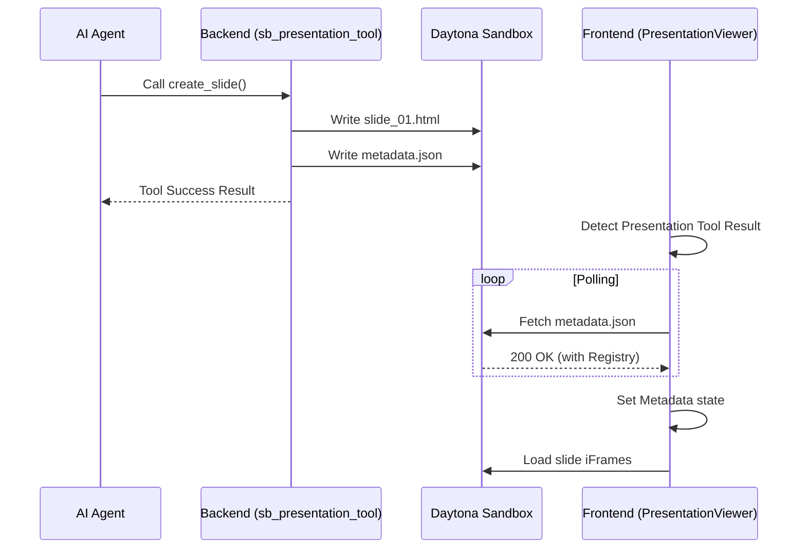

# Presentation Rendering Codemap

Researching the codebase reveals a sophisticated presentation rendering system that integrates AI agent tool calls with real-time sandbox file serving.

## A. File Structure (Core Files)

### Frontend
- `src/components/thread/tool-views/presentation-tools/PresentationViewer.tsx` ⭐ **CRITICAL**
    - The main entrance for rendering presentations in the chat thread. Manages metadata fetching, retry logic, and slide orchestration.
- `src/components/thread/tool-views/presentation-tools/PresentationSlideCard.tsx`
    - Renders an individual slide preview using an `<iframe>` pointing to the sandbox.
- `src/components/thread/tool-views/presentation-tools/FullScreenPresentationViewer.tsx`
    - Modal-based viewer for high-fidelity presentation viewing.
- `src/components/thread/tool-views/utils/presentation-utils.ts`
    - Helper functions for parsing paths and handling downloads/exports (PDF, PPTX, Google Slides).
- `src/stores/presentation-viewer-store.ts`
    - Global state for managing the full-screen modal visibility and current slide.

### Backend
- `core/tools/sb_presentation_tool.py` ⭐ **CRITICAL**
    - Discrete tool for AI agents to create/update slides and manage the `metadata.json` file in the Daytona sandbox.
- `core/templates/presentations_api.py`
    - API for serving template-specific previews (images/PDFs).

---

## B. File Structure (Comprehensive)

```text
d:/Homelab/suna/
├── backend/
│   └── core/
│       ├── tools/
│       │   ├── sb_presentation_tool.py           # Logic for creating slides in sandbox ⭐ CRITICAL
│       │   └── presentation_styles_config.py     # Style definitions for custom themes
│       └── templates/
│           ├── presentations/                    # Static template files
│           └── presentations_api.py              # API to list/preview templates
└── frontend/
    └── src/
        ├── components/
        │   └── thread/
        │       └── tool-views/
        │           ├── presentation-tools/
        │           │   ├── PresentationViewer.tsx           # Orchestrator & Metadata loader ⭐ CRITICAL
        │           │   ├── PresentationSlideCard.tsx        # Slide iframe wrapper
        │           │   ├── PresentationSlidePreview.tsx     # Small preview item
        │           │   ├── FullScreenPresentationViewer.tsx # Full-screen modal
        │           │   └── ... (List/Delete/Export views)
        │           └── shared/
        │               └── LoadingState.tsx                 # The "Loading presentation" UI
        ├── stores/
        │   └── presentation-viewer-store.ts                 # Zustand store for global viewer state
        └── lib/
            └── utils/
                └── url.ts                                   # Sandbox URL construction logic
```

---

## C. Architecture & Data Flow

### 1. Presentation Creation Flow
1. **Agent Call**: The AI Agent invokes `create_slide` via the `Presentations` tool.
2. **Sandbox Operation**: `sb_presentation_tool.py` creates a directory structure in the Daytona sandbox:
   ```text
   /workspace/presentations/
   └── [presentation_name]/
       ├── metadata.json       # Index of all slides and metadata ⭐
       └── slide_01.html       # Individual slide HTML
   ```
3. **Metadata Update**: Every time a slide is created, `metadata.json` is rewritten with the updated slide list.
4. **Tool Result**: The tool returns a JSON object with `presentation_name` and `slide_number`.

### 2. Frontend Rendering Flow
1. **Tool Output Parsing**: `PresentationViewer.tsx` receives the tool result.
2. **Sandbox Readiness**: It ensures the sandbox is active and retrieves the `sandbox_url`.
3. **Metadata Fetching**: It attempts to `fetch` the `metadata.json` from the sandbox.
   - **Endpoint**: `https://[sandbox-id].daytona.api/presentations/[name]/metadata.json`
4. **Retry Logic**: If the fetch fails (common if the sandbox is waking up), it enters a retry loop with exponential backoff.
   - *This is the "Retrying... (attempt X)" state the user is seeing.*
5. **Slide Rendering**: Once metadata is available, it maps through the `slides` object and renders `PresentationSlideCard` components.
6. **Iframe Loading**: Each card contains an `<iframe>` that loads the specific `slide_XX.html` directly from the sandbox.

### 3. Interaction Flow (Mermaid)



---

## D. Code Examples

### Metadata Structure (`metadata.json`)
This file is the "glue" that allows the frontend to know how many slides exist and what their titles are.
```json
{
  "presentation_name": "marketing_deck",
  "title": "Strategy 2026",
  "description": "Annual strategy presentation",
  "slides": {
    "1": {
      "title": "Introduction",
      "filename": "slide_01.html",
      "file_path": "presentations/marketing_deck/slide_01.html",
      "preview_url": "/workspace/presentations/marketing_deck/slide_01.html",
      "created_at": "2026-01-24T..."
    }
  },
  "created_at": "2026-01-24T...",
  "updated_at": "2026-01-24T..."
}
```

### Frontend Fetch Logic (`PresentationViewer.tsx`)
```typescript
const loadMetadata = useCallback(async (retryCount = 0) => {
    // ... validation logic ...
    const response = await fetch(`${sandboxUrl}/presentations/${name}/metadata.json`);
    if (response.ok) {
        const data = await response.json();
        setMetadata(data);
    } else {
        // Enters retry loop...
    }
}, [...]);
```

---

## E. Troubleshooting "Infinite Loading / Retrying"

Based on the codemap, the "Retrying" issue usually stems from one of the following:

1. **Sandbox URL Staleness**: The `project.sandbox.sandbox_url` might be outdated or incorrect.
2. **Missing `metadata.json`**: The agent might have failed to write the metadata file, or used a generic `create_file` call instead of the `create_slide` function.
3. **CORS / Sandbox Sleep**: The sandbox might be in a "sleep" state or the Proxy (Daytona) is returning 502/503 during wake-up, which triggers the retry logic.
4. **Path Sanitization Mismatch**: The frontend and backend might be using slightly different sanitization for the `presentation_name`, leading to a 404 on the `metadata.json` path.
