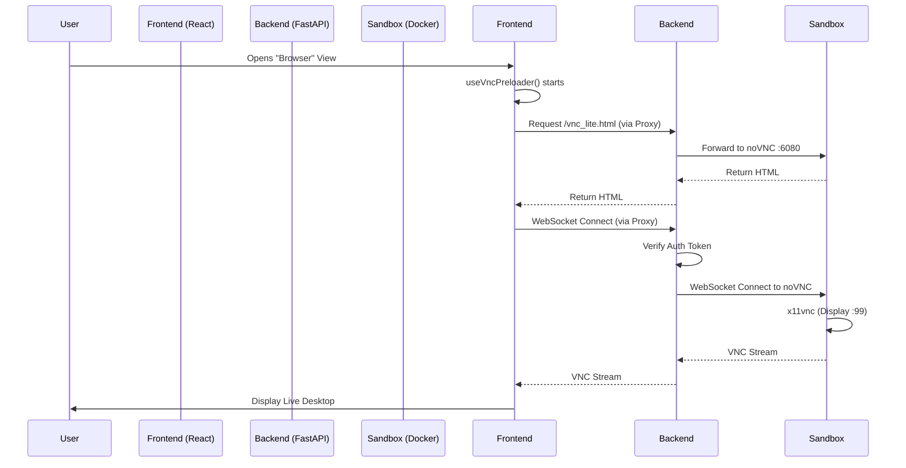

# VNC Streaming Codemap

## Overview
This document maps the architecture and implementation of the VNC streaming feature in Kortix (Suna). This feature allows users to view a live, interactive desktop environment (Daytona sandbox) directly within the web UI.

## File Structure (Core Files)

```text
backend/core/sandbox/
├── api.py                           # ⭐ CRITICAL: Handles VNC proxying (WebSocket & HTTP)
├── sandbox.py                       # ⭐ CRITICAL: Configures sandbox env vars (Resolution, VNC password)
└── docker/
    ├── Dockerfile                   # ⭐ CRITICAL: Installs Xvfb, x11vnc, noVNC; sets default resolution
    └── supervisord.conf             # ⭐ CRITICAL: Manages Xvfb, x11vnc, and noVNC processes

frontend/src/
├── components/thread/
│   ├── HealthCheckedVncIframe.tsx   # ⭐ CRITICAL: Renders the VNC iframe with connection handling
│   └── tool-call-side-panel.tsx     # Container that displays the VNC view
└── hooks/files/
    └── useVncPreloader.ts           # ⭐ CRITICAL: Manages VNC connection preloading and retries
```

## Architecture & Data Flow

### 1. Sandbox Initialization (Backend)
When a sandbox is created (via `backend/core/sandbox/sandbox.py`), specific environment variables are injected to configure the display:
- `RESOLUTION`: Sets the Xvfb screen size (e.g., `1440x900x24`).
- `VNC_PASSWORD`: Sets the authentication password for the VNC server.

### 2. Container Startup (Docker)
Inside the Daytona sandbox container (`backend/core/sandbox/docker/`):
1.  **Supervisord** starts:
    -   **Xvfb**: Creates a virtual framebuffer (display `:99`).
    -   **x11vnc**: Attaches to `:99` and exposes a VNC server on port `5901`.
    -   **noVNC**: Starts a web-based VNC client on port `6080`, proxying to `localhost:5901`.

### 3. Connection Proxying (Backend API)
The backend (`backend/core/sandbox/api.py`) exposes endpoints to proxy traffic to the sandbox's noVNC server, bypassing CORS and network isolation:
-   `GET /sandboxes/{id}/proxy/{port}/{path}`: Proxies static assets (HTML, JS, CSS) from noVNC.
-   `WebSocket /sandboxes/{id}/proxy/{port}/{path}`: Proxies the WebSocket connection for the VNC stream.
    -   **Authentication**: Validates JWT tokens from query params, headers, or cookies.
    -   **Protocol Translation**: Converts `http/https` to `ws/wss` for the upstream connection.

### 4. Frontend Rendering (React)
The frontend displays the stream using an `iframe`:
1.  **`useVncPreloader.ts`**:
    -   Constructs the VNC URL: `{sandbox_preview_url}/vnc_lite.html?password={pass}...`
    -   Creates a hidden iframe to "preload" the connection and ensure the socket is ready.
    -   Handles retries with exponential backoff if the connection fails (e.g., sandbox starting up).
2.  **`HealthCheckedVncIframe.tsx`**:
    -   Once preloaded, renders the visible `iframe` pointing to the proxied noVNC URL.
    -   Maintains a `16:10` aspect ratio to match the backend resolution (1440x900).
    -   Passes the auth token in the URL to authenticate with the backend proxy.

## Component Interaction Flow



## Critical Code Snippets

### Backend Proxy (WebSocket)
`backend/core/sandbox/api.py`
```python
@router.websocket("/sandboxes/{sandbox_id}/proxy/{port}/{path:path}")
async def proxy_daytona_websocket(websocket: WebSocket, ...):
    await websocket.accept()
    # ... Auth verification ...
    
    # Get upstream URL
    sandbox = await get_sandbox_by_id_safely(client, sandbox_id)
    preview_link = await sandbox.get_preview_link(port)
    
    # Proxy traffic
    async with aiohttp.ClientSession() as session:
        async with session.ws_connect(target_url) as ws_server:
            # Bidirectional piping
            await asyncio.gather(
                pipe_ws(websocket, ws_server),
                pipe_ws(ws_server, websocket)
            )
```

### Frontend Preloader
`frontend/src/hooks/files/useVncPreloader.ts`
```typescript
const startPreloading = useCallback((vncUrl: string) => {
    // Create hidden iframe
    const iframe = document.createElement('iframe');
    iframe.src = vncUrl;
    iframe.style.width = '1440px'; // Matches sandbox resolution
    iframe.style.height = '900px';
    
    // Handle load/error events for retries
    iframe.onload = () => setStatus('ready');
    iframe.onerror = () => retry();
    
    document.body.appendChild(iframe);
}, []);
```

## Configuration

| Setting | Value | Location |
| :--- | :--- | :--- |
| **Resolution** | `1440x900x24` | `sandbox.py`, `Dockerfile`, `useVncPreloader.ts` |
| **VNC Port** | `5901` | `supervisord.conf`, `Dockerfile` |
| **noVNC Port** | `6080` | `supervisord.conf`, `Dockerfile` |
| **Aspect Ratio** | `16:10` | `HealthCheckedVncIframe.tsx` |
