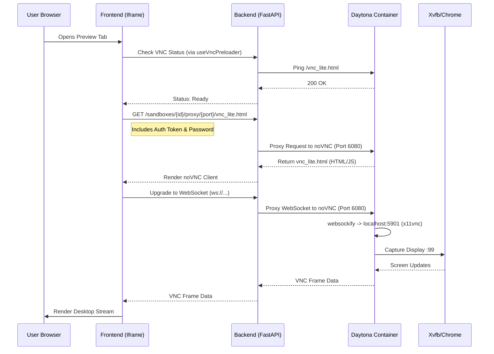

# VNC Streaming Codemap

This document maps out the technical implementation of the VNC streaming feature, which enables live browser previews from the Daytona sandbox to the frontend.

## A. File Structure (Core Files)

- **Backend Proxy**: `backend/core/sandbox/api.py` ⭐ CRITICAL
- **Frontend Component**: `frontend/src/components/thread/HealthCheckedVncIframe.tsx` ⭐ CRITICAL
- **Container Config**: `backend/core/sandbox/docker/Dockerfile`
- **Process Manager**: `backend/core/sandbox/docker/supervisord.conf`
- **Frontend Hook**: `frontend/src/hooks/files/useVncPreloader.ts`

## B. File Structure (Comprehensive)

```text
backend/core/sandbox/
├── api.py                           # FastAPI endpoints for proxying VNC/HTTP traffic ⭐ CRITICAL
│   ├── proxy_daytona_preview()      # Proxies HTTP requests (HTML, JS, CSS)
│   └── proxy_daytona_websocket()    # Proxies WebSocket connections (noVNC)
└── docker/
    ├── Dockerfile                   # Installs Xvfb, x11vnc, noVNC, Chrome ⭐ CRITICAL
    ├── supervisord.conf             # Manages Xvfb, x11vnc, noVNC processes ⭐ CRITICAL
    └── browserApi.ts                # Node.js server for browser automation (Playwright)

frontend/src/
├── components/thread/
│   └── HealthCheckedVncIframe.tsx   # Renders the VNC iframe & handles connection state ⭐ CRITICAL
└── hooks/files/
    └── useVncPreloader.ts           # Checks if VNC server is ready before rendering
```

## C. Architecture & Data Flow

### High-Level Overview

The system allows users to view a live desktop environment (running Chrome) inside the Daytona sandbox. This is achieved by:
1.  Running a virtual display (Xvfb) and VNC server (x11vnc) inside the container.
2.  Exposing VNC via WebSockets using noVNC/websockify.
3.  Proxying this traffic through the Backend API to avoid CORS/Auth issues and expose it securely to the Frontend.

### Connection Flow



### Component Interaction

1.  **Daytona Container**:
    *   **Xvfb**: Creates a virtual framebuffer (display `:99`) so Chrome can run headlessly but still render UI.
    *   **x11vnc**: Captures the Xvfb framebuffer and exposes it via the RFB protocol on port `5901`.
    *   **noVNC (websockify)**: Bridges the TCP VNC traffic (5901) to WebSockets (6080) so browsers can connect.
    *   **Supervisord**: Ensures all these processes start in the correct order and stay running.

2.  **Backend Proxy (`api.py`)**:
    *   Acts as a gateway. It authenticates the user and then forwards traffic to the internal Daytona IP/URL.
    *   **`proxy_daytona_preview`**: Handles static assets (HTML, JS, CSS) served by noVNC. It also handles HTML unescaping if necessary.
    *   **`proxy_daytona_websocket`**: Handles the persistent WebSocket connection. It verifies the JWT token (from query param, header, or cookie) and establishes a tunnel to the container.

3.  **Frontend (`HealthCheckedVncIframe.tsx`)**:
    *   Embeds an `<iframe>` pointing to the backend proxy URL.
    *   Constructs the URL with `password`, `autoconnect=true`, and `scale=local` query params for the noVNC client.
    *   Uses `useVncPreloader` to avoid showing a broken iframe while the container is starting up.

## D. Code Examples

### 1. Backend WebSocket Proxy (`backend/core/sandbox/api.py`)

This function handles the critical WebSocket tunnel, including authentication fallback.

```python
@router.websocket("/sandboxes/{sandbox_id}/proxy/{port}/{path:path}")
async def proxy_daytona_websocket(
    websocket: WebSocket,
    sandbox_id: str,
    port: int,
    path: str
):
    await websocket.accept()
    
    # 1. Authentication (Query -> Header -> Cookie)
    token = websocket.query_params.get("token")
    if not token:
        # ... fetch from headers or cookies ...
        
    # 2. Verify Access
    # ... verify_sandbox_access_optional ...

    # 3. Connect to Upstream
    async with aiohttp.ClientSession() as session:
        async with session.ws_connect(target_url, headers=headers) as upstream_ws:
            # 4. Bidirectional Proxying
            async def client_to_upstream():
                async for msg in websocket.iter_bytes():
                    await upstream_ws.send_bytes(msg)
                    
            async def upstream_to_client():
                async for msg in upstream_ws:
                    if msg.type == aiohttp.WSMsgType.BINARY:
                        await websocket.send_bytes(msg.data)
                    # ... handle other types ...

            await asyncio.gather(client_to_upstream(), upstream_to_client())
```

### 2. Container Process Setup (`backend/core/sandbox/docker/supervisord.conf`)

Orchestrates the display server, VNC server, and WebSocket proxy.

```ini
[program:xvfb]
command=bash -c "rm -f /tmp/.X99-lock /tmp/.X11-unix/X99 && Xvfb :99 -screen 0 %(ENV_RESOLUTION)s -ac +extension GLX +render -noreset"
priority=100

[program:x11vnc]
command=bash -c "... DISPLAY=:99 x11vnc -display :99 -forever -shared -rfbauth /root/.vnc/passwd -rfbport 5901 ..."
priority=200
depends_on=vnc_setup,xvfb

[program:novnc]
command=bash -c "sleep 5 && cd /opt/novnc && ./utils/novnc_proxy --vnc localhost:5901 --listen 0.0.0.0:6080 --web /opt/novnc"
priority=300
depends_on=x11vnc
```

## E. Key Mechanisms & Configuration

### Authentication
- **Token Passing**: Since WebSockets don't support custom headers in the browser API (standard `new WebSocket()`), the auth token is often passed via query parameter (`?token=...`) or cookies.
- **Verification**: The backend extracts this token, validates the JWT, and ensures the user has access to the specific sandbox ID.

### Networking
- **Internal**: Container ports (5901, 6080) are not necessarily exposed to the public internet. They are reached by the Backend via the internal Docker network or Daytona's mesh network.
- **External**: The Frontend only talks to the Backend (`/sandboxes/...`). This keeps the architecture secure and avoids exposing raw VNC ports.

### Browser Automation
- **Playwright**: The Dockerfile installs Playwright and Chromium.
- **browserApi.ts**: A Node.js server runs inside the container to accept automation commands (likely via HTTP/WS) and control the Chrome instance that is visible on the VNC display.
